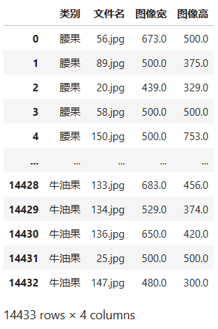
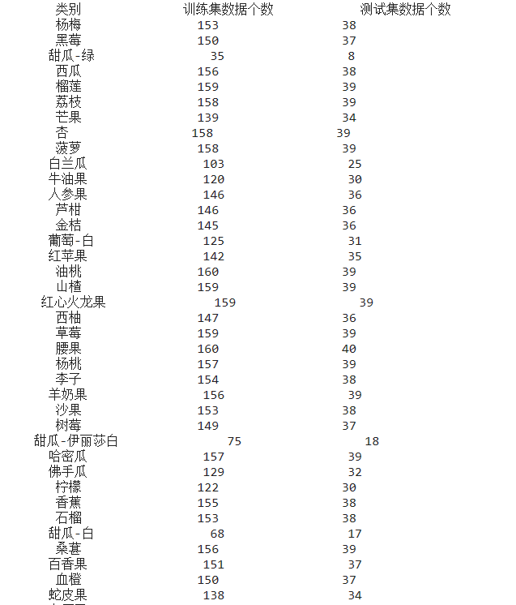
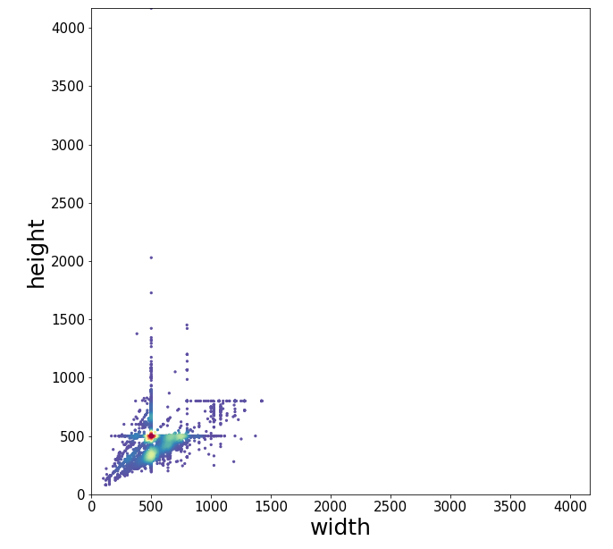
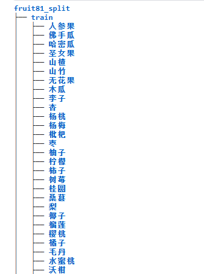
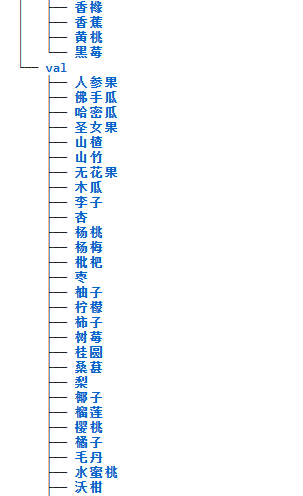
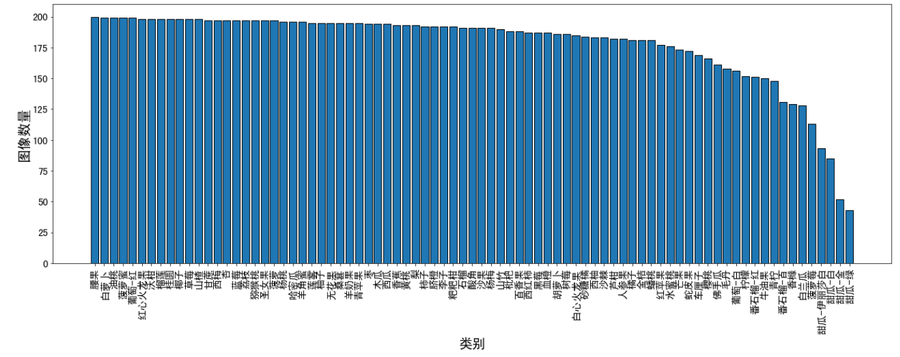
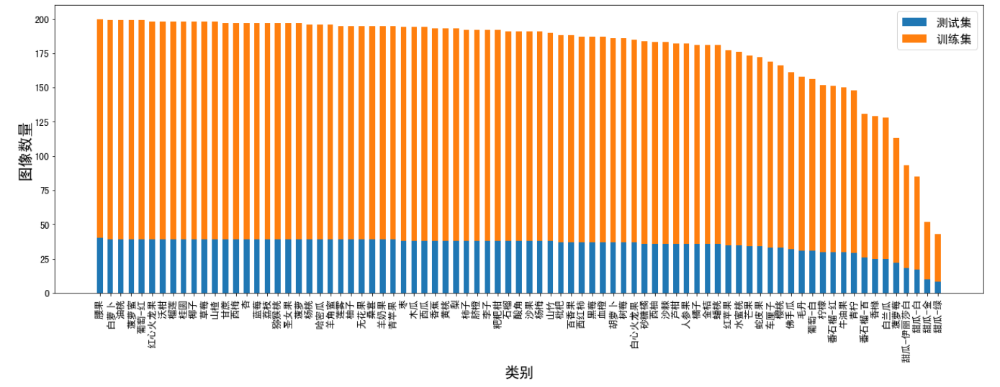

# 1.构建专属训练数据集

## 一、为什么要学习如何构建训练数据集

当我们在做机器学习或者深度学习工作的时候，我们都是基于以及数据集进行展开的，所以如果我们想要让我们最终的工作结果能够满足我们的预期的话，一个**构造良好**的训练数据集是必不可少的。

比如我们的训练数据集应该具有：

* 多样性
* 代表性
* 一致性

以本次学习的**fruit81数据集**为例，我们的采集图片应该能够包括到不同尺寸、比例的图片；不同环境的图片；不同时期的图片；以及不同背景的图片等等，这样训练出来的结果的**泛化能力**（应用于训练集之外的情况的分类能力）才是足够强的，模型也是能够很好**鲁棒**的。


## 二、图像采集的方法

本次学习中提到的图像采集方法是基于百度图片的图片库的图像采集方法，主要是应用pyhton的网络爬虫技术，通过自己设定相关的爬取关键词以及模拟cookie的身份标识，来完成指定内容的爬取。

<font color='red'>注意：请遵守国家相关法律规和互联网数据使用规定。请勿用于商业用途，请勿高频长时间访问服务器，请勿用于网络攻击，请勿恶意窃取信息，请勿用于作恶。</font>


## 三、制作训练数据集

### 1.注意事项

由于数据集需要有我们之前提到的**多样性、代表性、一致性**的特点，所以我们在做数据集采集的时候要兼顾到以上的特性。

那么如果我们在采集图片的时候没有注意上述特性，会发生什么问题？答案就是可能引发`OOD（Out-Of-Distribution）泛化问题`。即，训练集与测试集图像分布不一致的。例如训练集是一串葡萄，而测试集是一颗一颗的葡萄（测试集能分类出来就厉害了）

### 2.删除多余文件

同时在我们windows和mac上执行python代码的时候都会自动生成一些**隐藏文件**，这些文件有时会引发各种各样的错误，例如读取错误等等。例如`.ipynb_checkpoints`；

使用的也是linux的指令

```python
!for i in `find . -iname '.ipynb_checkpoints'`; do rm -rf $i;done
```

同时也可以**删除gif文件**和**非三通道**的文件

```python
dataset_path = 'dataset_delete_test'

for fruit in tqdm(os.listdir(dataset_path)):
    for file in os.listdir(os.path.join(dataset_path, fruit)):
        file_path = os.path.join(dataset_path, fruit, file)
        img = cv2.imread(file_path)
        if img is None:
            print(file_path, '读取错误，删除')
            os.remove(file_path)
            
import numpy as np
from PIL import Image
for fruit in tqdm(os.listdir(dataset_path)):
    for file in os.listdir(os.path.join(dataset_path, fruit)):
        file_path = os.path.join(dataset_path, fruit, file)
        img = np.array(Image.open(file_path))
        try:
            channel = img.shape[2]
            if channel != 3:
                print(file_path, '非三通道，删除')
                os.remove(file_path)
        except:
            print(file_path, '非三通道，删除')
            os.remove(file_path)
```

### 3.下载数据集

本次学习的数据集我们可以从网上进行下载，使用**linux指令**进行下载和解压缩

```python
# 下载数据集
!wget https://zihao-openmmlab.obs.cn-east-3.myhuaweicloud.com/20220716-mmclassification/dataset/fruit81/fruit81_full.zip
# 解压
!unzip fruit81_full.zip >> /dev/null
```

数据集下载好了之后我们就可以使用python的`pandas`库进行数据集的读取，最终的读取效果是类似`excel`的结果。



### 4.划分训练集与测试集

如果是采用的下载未划分的数据集，我们可以通过7:3的比例对数据集进行划分为训练集和测试集。



## 四、数据集可视化

### 1.图像大小可视化

我们可以可视化出我们下载的数据集中所有图片大小的尺寸分布情况，这样我们可以很清晰的观察到图像的尺寸集中在哪一个范围，以便于我们后续对图片进行预处理统一大小。



### 2.数据集树状结构可视化

通过使用linux的指令可以可视化我们的数据集的文件结构

```python
!tree fruit81_split -L 2
```




### 3.数据集图像可视化

我们也可以通过遍历的方式对数据集中的图片进行可视化输出


### 4.柱状图可视化

我们还可以通过柱状图的形式对我们的数据进行可视化，注意如果我们的数据集中有中文的话，需要添加一个matplotlib中的文字格式`SimHei`，才能输出中文的表示。（我没成功可能是我用的是kaggle的平台，也可能是我没重启kernel）

```python
# 运行完毕后重启 kernel，再从头运行一次
!wget https://zihao-openmmlab.obs.cn-east-3.myhuaweicloud.com/20220716-mmclassification/dataset/SimHei.ttf -O /environment/miniconda3/lib/python3.7/site-packages/matplotlib/mpl-data/fonts/ttf/SimHei.ttf
!rm -rf /home/featurize/.cache/matplotlib

import matplotlib
matplotlib.rc("font",family='SimHei') # 中文字体
# plt.rcParams['font.sans-serif']=['SimHei']  # 用来正常显示中文标签
plt.rcParams['axes.unicode_minus']=False  # 用来正常显示负号
```





## 五、如何完成图像分类任务

最常见的就是我们自己动手丰衣足食，自己搭建自己的模型来完成分类任务，但是其实也有一些网上现成的专门用于做分类任务的模型，我们如果自己制作应用，只是想要比较好的完成任务，而不需要深入的理解里面的机制的话，可以选择网上现成的模型。

现成的：

* [百度飞桨EasyDL](https://ai.baidu.com/easydl/)
* [华为云ModelArts一站式AI开发平台](https://www.huaweicloud.com/product/modelarts.html)

当然我觉得自己写的出来能够使用的模型才是最酷的。

## kaggle平台使用过程中的一些小经验

因为kaggle平台一个星期可以免费使用30h左右的gpu，所以我是通过使用kaggle的平台来进行实验的。在实验过程中我发现如果将数据集直接导入到`input`中的话，在我们进行数据集划分的时候由于需要复制操作，会出现`only-read只读`的报错，查了一些资料发现kaggle里导入的数据集他就是只读格式的，所以我们在使用kaggle平台进行训练的时候我们可以不要在`input`中进行，而是选择在`working`的路径下进行，这样我们也可以保存我们的实验结果，还是很方便的。

最后我们平时应该多积累一些linux的常见指令，对我们实际做项目会很有帮助。
