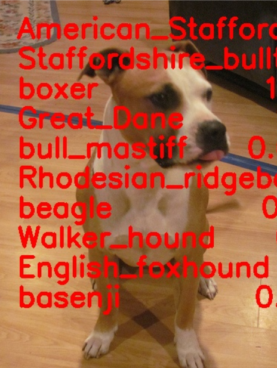
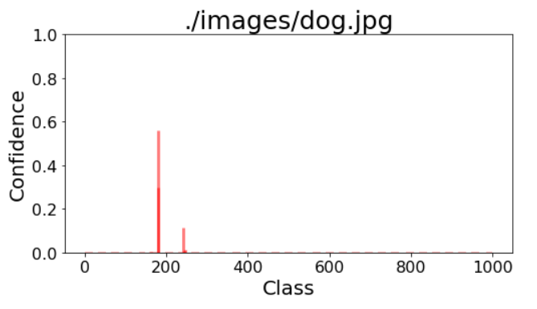
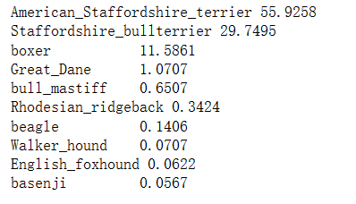
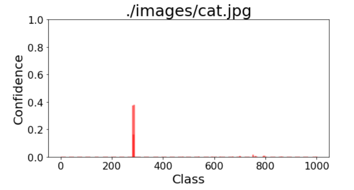
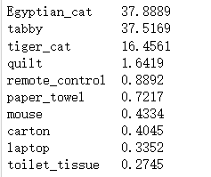
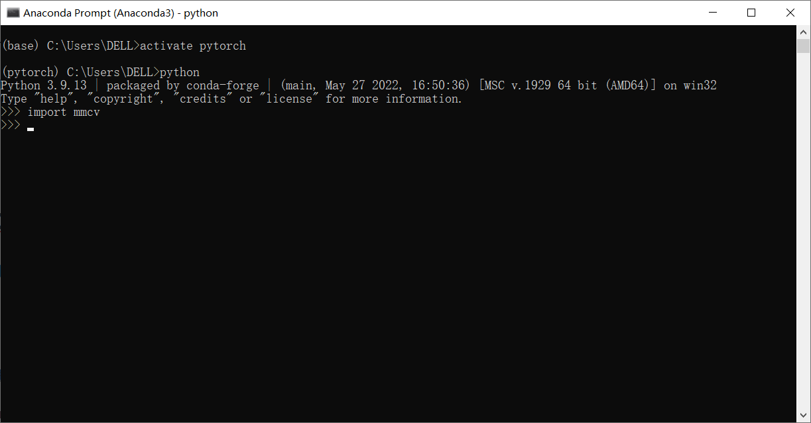
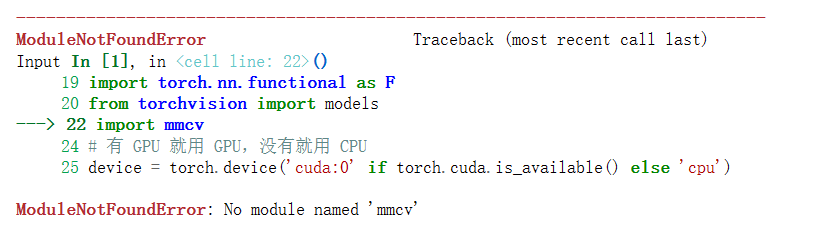

# 2.完成图像/视频/实时摄像头的分类任务

## 一、实验所需的配置

完成小节题目所示的图像分类任务我们首先需要确定所需要的实验环境（导包）

实验平台还是不用kaggle了，比较麻烦，选择了一个付费的云gpu平台：[featurize]([Featurize](https://featurize.cn/?s=d7ce99f842414bfcaea5662a97581bd1))

```python
# 下载一些必要的包
!pip install numpy pandas matplotlib requests tqdm opencv-python pillow gc -i https://pypi.tuna.tsinghua.edu.cn/simple

# 安装mmcv -full
!pip install mmcv-full -f https://download.openmmlab.com/mmcv/dist/cu113/torch1.10.0/index.html

# 下载中文字体
!wget https://zihao-openmmlab.obs.cn-east-3.myhuaweicloud.com/20220716-mmclassification/dataset/SimHei.ttf
```

其中`mmcv-full`是专门用来对视频文件进行读取和保存中间帧的方法库，相当方便。（本人之前学cv的时候其实cv也有可以实现的相关操作，就是不如mmcv-full那么便捷，几行代码就搞定了）。

本节最后我也会给出我之前学习cv的时候的一些代码给大家学习思考。

## 二、图像分类

#### 1.数据集选取

首先我们要进行图像分类会需要有数据集，而本次实验使用的是2010年就提出的包含1000个类别的`ImageNet`数据集，这个数据集涵盖了很多种不同的图像，[ImageNet 1000类别中文释义](https://github.com/ningbonb/imagenet_classes_chinese)。**但是**由于数据集比较古老而且没有包含一些比较多样性的图片，所以在使用的时候如果出现分类错误，请酌情分析原因。

#### 2.分类模型选取

本次分类使用的是一个18层的resnet模型（`resnet18`），这个模型是pytorch的models中自带的一个模型，用于做分类任务效果不错，具体这个模型的其他一些用处可以见我在**深入浅出pytorch课程**中的学习中写的有关resnet18的博客。

博客链接：[基于resnet18的pytorch可视化](https://blog.csdn.net/weixin_52836217/article/details/127015557?spm=1001.2014.3001.5501#11_Resnet18_12)

#### 3.导入预训练模型

使用pytorch的models中自带的resnet18函数的方法非常简单（调包侠即可）

```python
from torchvision import models
# 载入预训练图像分类模型
model = models.resnet18(pretrained=True) 
# 将模型放置为测试集和gpu上
model = model.eval()
model = model.to(device)

```

#### 4.图像预处理

这个部分的步骤根据大佬所教，其实是一个很固定的步骤即RCTN（缩放裁剪、转 Tensor、归一化）

```python
from torchvision import transforms

# 测试集图像预处理-RCTN：缩放裁剪、转 Tensor、归一化
test_transform = transforms.Compose([transforms.Resize(256),
                                     transforms.CenterCrop(224),
                                     transforms.ToTensor(),
                                     transforms.Normalize(
                                         mean=[0.485, 0.456, 0.406], 
                                         std=[0.229, 0.224, 0.225])
                                    ])
```

在做图像读入的时候我们通常可以使用`cv2.imread`来读取但是这种方式读取的信息格式都是**numpy数组**，无法用于我们之前的`tensor`的运算，所以我们使用另一种读取方式进行读取，即`pillow`

```python
# 用 pillow 载入
from PIL import Image
img_pil = Image.open(img_path)
# 也可以把pillow读取进来的图片转换成numpy数组
np.array(img_pil)
```

#### 5.图像分类

然后进行图像分类操作，就相当简单了

```python
# 数据预处理
input_img = test_transform(img_pil) 
# 在最开头添加一维即batch_size，例如读入图片为[3, 256, 256]变成[1, 3, 256, 256]
# 这样做的目的是因为pytorch内部需要这样的输入
input_img = input_img.unsqueeze(0).to(device)
# 执行前向预测，得到所有类别的 logit 预测分数
pred_logits = model(input_img) 
# 进行正则化输出位于（0-1）之间的各种类别概率值
import torch.nn.functional as F
pred_softmax = F.softmax(pred_logits, dim=1) # 对 logit 分数做 softmax 运算

```

完成图像分类预测之后，我们可以输出置信度的柱状图和将分类结果写在图片上。

输入一张dog的图片结果，如下图所示。



我们观察置信度发现有两个类别的结果比较明显，发现他分类结果与其说是像斯塔福德郡犬，更像一个美国 _ 工作人员 _ 承运人。（相当搞笑）

我们再运行一个cat的图片结果就会好很多，如下图所示。



置信度相当专一。

## 三、视频图像分类

#### 1.视频读入

视频图像的分类，本质上仍然是图像分类问题，我们对于一个视频获取它的**每一帧**的图片，然后进行图像分类之后，再将每一帧合并起来生成新的视频。

在这里我们可以使用`mmcv-full`包中的`mmcv`方法进行视频读入

```python
# 读入待预测视频
imgs = mmcv.VideoReader(input_video)

prog_bar = mmcv.ProgressBar(len(imgs))

# 对视频逐帧处理
for frame_id, img in enumerate(imgs):
    
    ## 处理单帧画面
    img, pred_softmax = pred_single_frame(img, n=5)

    # 将处理后的该帧画面图像文件，保存至 /tmp 目录下
    cv2.imwrite(f'{temp_out_dir}/{frame_id:06d}.jpg', img)
    
    prog_bar.update() # 更新进度条

# 把每一帧串成视频文件
mmcv.frames2video(temp_out_dir, 'output/output_pred.mp4', fps=imgs.fps, fourcc='mp4v')

shutil.rmtree(temp_out_dir) # 删除存放每帧画面的临时文件夹
print('删除临时文件夹', temp_out_dir)
```

其他的一些使用cv的视频读入和处理的方法，可以看我在本节笔记最后整理的学习cv时候的代码笔记。

#### 2.视频图像分类预测

我们可以对于一个视频的每一帧的图像进行分类预测，所使用的方法类似前面的图像分类的方法，并且我们也可以将分类结果的**置信度**显示在视频的左上角。

<font color="red">注意：如果在本机跑的时候无法导入mmcv，也可以用cv来做。代码如下</font>

```python
# 设置为0表示调用默认摄像头
cap = cv2.VideoCapture(input_video)
# 获取视频帧率fps
fps = cap.get(cv2.CAP_PROP_FPS)
# 获取每帧的宽度
frame_w = cap.get(cv2.CAP_PROP_FRAME_WIDTH)
# 获取每帧的高度
frame_h = cap.get(cv2.CAP_PROP_FRAME_HEIGHT)
print("fps:", fps, "frame_w", frame_w, "frame_h", frame_h)
# 计算机自动获取编码格式
fourcc = cap.get(cv2.CAP_PROP_FOURCC)
# 注意将编码格式fourcc转换成int类型
# 定义写入一个视频
writer_mp4 = cv2.VideoWriter('./output/output_pred.mp4', int(fourcc), fps, (int(frame_w), int(frame_h)))
# 循环读取图片完成视频
while True:
    # 摄像头读取,ret为是否成功打开摄像头,true,false。 frame为视频的每一帧图像
    ret, frame = cap.read()
    if ret is not True:
        break
    frame, pred_softmax = pred_single_frame(frame, n=5)
    cv2.imshow("frame", frame)
    # 间隔1ms播放下一帧
    c = cv2.waitKey(1)
    if c == 27:
        break
    # 写入视频帧，注意初始的帧数要和实际返回帧数一致
    writer_mp4.write(frame)

# 释放资源
cap.release()
writer_mp4.release()

# 任意键结束
cv2.waitKey(0)
cv2.destroyAllWindows()
# 视频文件执行之后会可能有警告但是不影响使用
```

原视频如下：https://github.com/lyc686/datawhale_study/blob/main/images/output.mp4


图像预测之后效果如下：https://github.com/lyc686/datawhale_study/blob/main/images/output_pred.mp4

#### 3.可视化

可视化我们可以采取下面两种方法进行

* 原始图像+分类预测结果文字
* 原始图像+分类预测结果文字+各类别置信度柱状图

## 四、实时摄像头分类

#### 1.摄像头数据读入

使用摄像头进行捕获实时画面的时候，我们需要使用自己的本地jupyter因为需要获取我们自己电脑的摄像头。

<font color="red">注意：如果摄像头没有权限的话可以右击此电脑，选择管理>>点击左侧的设备管理器>>展开图像设备>>找到我们的摄像头设备打开权限，或者更新驱动程序。</font>

```python
# 导入opencv-python
import cv2
import time

# 获取摄像头，传入0表示获取系统默认摄像头，如果有自己的外接摄像头的话应该是其他参数。
cap = cv2.VideoCapture(0)

# 打开cap
cap.open(0)

# 等待1ms
time.sleep(1)

# success表示是否成功打开摄像头，为True/False
# img_bgr是视频的每一帧图像
success, img_bgr = cap.read()
    
# 关闭摄像头，释放资源
cap.release()

# 关闭图像窗口
cv2.destroyAllWindows()
```

需要注意的是cv读取的图像默认是`BGR`格式的，如果需要的话我们应该通过`cv2.cvtCOLOR`函数转换为`RGB`的图像。

#### 2.视频图像处理

类比之前的处理方法，我们也可以完成视频图像的处理工作，并且能够预测出每一帧图像所属类别。

## 有关OpenCv的一些代码

其他的一些使用cv的**图像/视频**读入和处理的方法可以看我整理的学习cv时候的代码笔记，链接为：[OpenCv学习代码笔记](https://github.com/lyc686/OpenCv_study)

## 亲身体会使用建议

如果是在云GPU平台进行实验，因为是linux的环境所以`mmcv`比较容易实现，我本机用windows对应了很多次版本还是对应不上，干脆本机读入视频就用`cv`了。

寻找自己电脑对应的mmcv版本在这里：https://download.openmmlab.com/mmcv/dist/cu101/torch1.8.0/index.html，需要注意的是要同时考虑cuda和pytorch的版本，还是比较麻烦的。

一个比较宝藏的仓库：https://github.com/open-mmlab

```bash
# 先卸载之前安装的版本不匹配的mmcv
pip uninstall mmcv-full
pip install /你的路径/mmcv_full版本的.whl
```

像我这里已经安装成功并且能够import，但是在jupyter中仍然无法使用说明版本还是不对。


