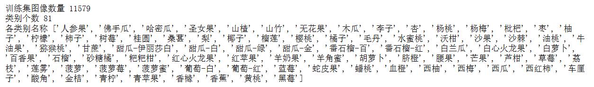
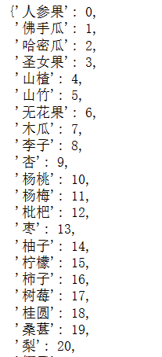
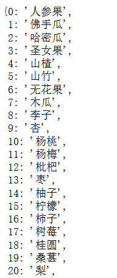
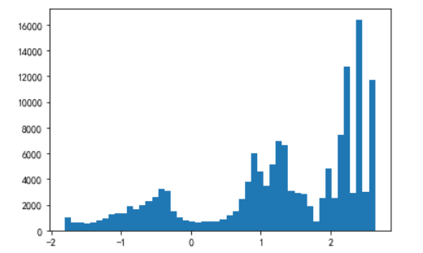
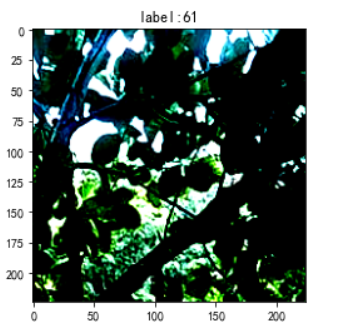
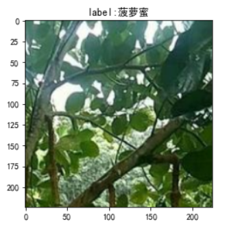
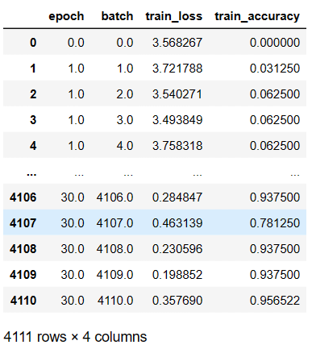
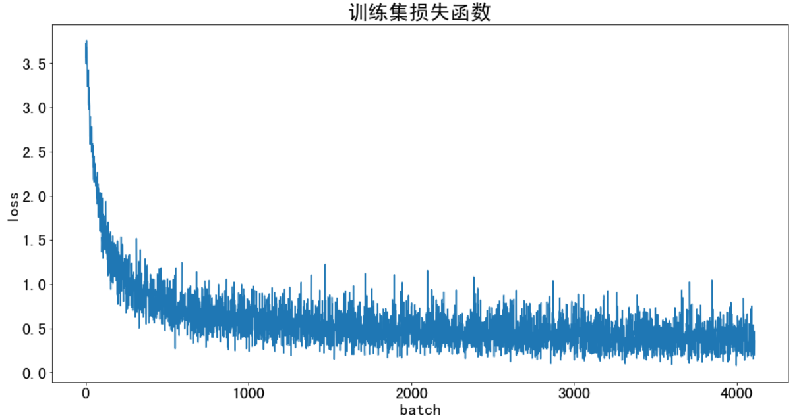
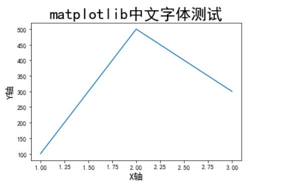
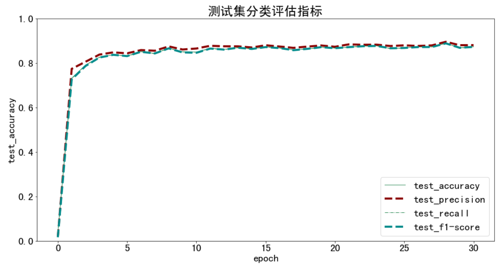

# 3.迁移学习-将ImageNet中的模型应用在自己的数据集上

## 一、迁移学习

迁移学习简单来说就是**站在巨人的肩膀上**，通过使用在ImageNet的1000类图像数据集上训练出来的模型`resnet18`，直接套用在我们自己的数据集上。

对于现成的resnet18模型我们可以：

* 只微调最后一层全连接层，使其输出我们想要的分类类别
* 微调训练所有层
* 随机初始化模型全部权重，从头训练所有层

## 二、实验部分

### 1.数据集构建

首先由于前面第一次任务我们已经学习到了如何构建自己的专属数据集，笔记链接如下：[1.构建自己的数据集](https://github.com/lyc686/datawhale_study/blob/main/classify_with_pytorch/1.Making_train_val_dataset.md)如果忘记了步骤可以去复习一下。

学习如何自己构建数据集的目的是能够更好的为自己的实际需求服务。

### 2.模型训练

**（1）首先是做数据的预处理**，还是规范步骤的`RCTN（缩放裁剪、图像增强、转 Tensor、归一化）`

```python
from torchvision import transforms

# 训练集图像预处理：缩放裁剪、图像增强、转 Tensor、归一化
train_transform = transforms.Compose([transforms.RandomResizedCrop(224),
                                      transforms.RandomHorizontalFlip(),
                                      transforms.ToTensor(),
                                      transforms.Normalize([0.485, 0.456, 0.406], [0.229, 0.224, 0.225])
                                     ])

# 测试集图像预处理-RCTN：缩放、裁剪、转 Tensor、归一化
test_transform = transforms.Compose([transforms.Resize(256),
                                     transforms.CenterCrop(224),
                                     transforms.ToTensor(),
                                     transforms.Normalize(
                                         mean=[0.485, 0.456, 0.406], 
                                         std=[0.229, 0.224, 0.225])
                                    ])
```

**（2）然后是进行数据读入**，在`pytorch`中使用的数据读入方式是`Dataset+Dataloader`，其中Dataset负责将数据集读入，Dataloader负责每一批次读入数据的大小(batch-size)。

```python
from torchvision import datasets

# 数据集文件夹路径
dataset_dir = 'fruit81_split'
train_path = os.path.join(dataset_dir, 'train')
test_path = os.path.join(dataset_dir, 'val')
print('训练集路径', train_path)
print('测试集路径', test_path)

# 载入训练集
train_dataset = datasets.ImageFolder(train_path, train_transform)

# 载入测试集
test_dataset = datasets.ImageFolder(test_path, test_transform)

# 打印数据集信息
print('训练集图像数量', len(train_dataset))
print('类别个数', len(train_dataset.classes))
print('各类别名称', train_dataset.classes)
```



当然通常情况下我们除了上述代码中提到的`dataset`自带的数据读入的方法`ImageFolder`，我们也可以自己重新初始化一个Dataset来满足我们不同的数据读入需求。而`dataloader`一般不需要自定义。

例如，自己写dataset+dataloader的**通用模板**如下：

```
# 按照下面的结构定义自己的Dataset，MyDataset是类的命名，可以改成自己的
class MyDataset(torch.utils.data.Dataset):
    def __init__(self):
        # TODO
        # 1. Initialize file paths or a list of file names.
        pass
    def __getitem__(self, index):
        # TODO
        # 1. 从文件读取数据
        # 2. 数据预处理
        # 3. 返回所需数据的内容（例如，images,labels）
        pass
    def __len__(self):
        # 返回数据集长度，将0的部分替换成len()
        return 0

# dataloader的定义
my_dataset = MyDataset()
train_loader = torch.utils.data.DataLoader(dataset=my_dataset,
                                           batch_size=64,
                                           shuffle=True,
                                           num_workers=0)
# batch_size = 64表示一批(1个epoch读取64个)
# shuffle = True 表示读取的时候随机打乱，一般训练集的shuffle设为True，测试集的shuffle设为False
# num_workers表示cpu的线程数，如果没有gpu建议设成0，即只有一个主线程，不然会报错
```

**（3）对图片进行可视化**，对于我们读取进来的图片，我们可以打印出他的**索引号到类别**的映射，也可以打印出他**类别到索引号的映射**。

```python
# 映射关系：索引号 到 类别
idx_to_labels = {y:x for x,y in train_dataset.class_to_idx.items()}

# 映射关系：类别 到 索引号
train_dataset.class_to_idx
```



对于图片我们可以可视化查看某一张图片中的像素的分布情况（由于我们在读入图片的时候预处理中有**归一化**的部分，所以我们的图片的像素是在0左右的范围内的**有正有负**的值）





另外由于我们归一化的存在所以我们的图片如果显示出来已经和原图是不一样的了，如果想打印原图，需要对图片按照归一化的过程反着来一次。

```python
# batch 中经过预处理的图像
idx = 2
plt.imshow(images[idx].transpose((1,2,0))) # 转为(224, 224, 3)
plt.title('label:'+str(labels[idx].item()))

# 原始图像
idx = 2
mean = np.array([0.485, 0.456, 0.406])
std = np.array([0.229, 0.224, 0.225])
plt.imshow(np.clip(images[idx].transpose((1,2,0)) * std + mean, 0, 1))
plt.title('label:'+ pred_classname)
plt.show()
```



### 3.迁移学习训练模型

我们可以按照第一部分提到的三种方式对模型进行训练

```python
# 选择一：只微调训练模型最后一层（全连接分类层）
model = models.resnet18(pretrained=True) # 载入预训练模型

# 修改全连接层，使得全连接层的输出与当前数据集类别数对应
# 新建的层默认 requires_grad=True
model.fc = nn.Linear(model.fc.in_features, n_class)
# 只微调训练最后一层全连接层的参数，其它层冻结
optimizer = optim.Adam(model.fc.parameters())
```

```python
# 选择二：微调训练所有层
model = models.resnet18(pretrained=True) # 载入预训练模型

model.fc = nn.Linear(model.fc.in_features, n_class)

optimizer = optim.Adam(model.parameters())
```

```python
# 选择三：随机初始化模型全部权重，从头训练所有层
model = models.resnet18(pretrained=False) # 只载入模型结构，不载入预训练权重参数

model.fc = nn.Linear(model.fc.in_features, n_class)

optimizer = optim.Adam(model.parameters())
```

然后我们可以根据标准的训练步骤进行训练

```python
# 遍历每个 EPOCH
for epoch in tqdm(range(EPOCHS)):
	# 训练模式
    model.train()

    for images, labels in train_loader:  # 获得一个 batch 的数据和标注
        images = images.to(device)
        labels = labels.to(device)

        outputs = model(images)
        loss = criterion(outputs, labels) # 计算当前 batch 中，每个样本的平均交叉熵损失函数值
        
        # 反向传播三部曲
        optimizer.zero_grad()
        loss.backward()
        optimizer.step()
```

同理可以在测试集上训练

```python
# 测试模式
model.eval()
with torch.no_grad():
    correct = 0
    total = 0
    for images, labels in tqdm(test_loader):
        images = images.to(device)
        labels = labels.to(device)
        outputs = model(images)
        _, preds = torch.max(outputs, 1)
        total += labels.size(0)
        correct += (preds == labels).sum()

    print('测试集上的准确率为 {:.3f} %'.format(100 * correct / total))
```

最后我们可以将最终的模型的参数保存下来

```python
torch.save(model, 'checkpoints/fruit30_pytorch_20220814.pth')
```

### 4.更进一步的可视化

在训练的基础上我们可以使用`保存日志`的方式来对loss，auc，acc，F1等值标进行可视化。也可以使用`wandb`网站进行更进一步的可视化。并且wandb网站可以通过移动端输入生成网址进行访问，实时查看训练情况。

（1）首先很简单的一种方式就是用一个**字典**将所有的日志信息存储下来，最终保存成一个csv文件，再通过读取文件进行plt绘图可视化。

训练开始之前，记录日志：

```python
epoch = 0
batch_idx = 0
best_test_accuracy = 0

# 训练日志-训练集
df_train_log = pd.DataFrame()
log_train = {}
log_train['epoch'] = 0
log_train['batch'] = 0
images, labels = next(iter(train_loader))
log_train.update(train_one_batch(images, labels))
df_train_log = df_train_log.append(log_train, ignore_index=True)
```

重新写加上了日志之后的训练集函数：

```python
def train_one_batch(images, labels):
    '''
    运行一个 batch 的训练，返回当前 batch 的训练日志
    '''
    
    # 获得一个 batch 的数据和标注
    images = images.to(device)
    labels = labels.to(device)
    
    outputs = model(images) # 输入模型，执行前向预测
    loss = criterion(outputs, labels) # 计算当前 batch 中，每个样本的平均交叉熵损失函数值
    
    # 优化更新权重
    optimizer.zero_grad()
    loss.backward()
    optimizer.step()
    
    # 获取当前 batch 的标签类别和预测类别
    _, preds = torch.max(outputs, 1) # 获得当前 batch 所有图像的预测类别
    preds = preds.cpu().numpy()
    loss = loss.detach().cpu().numpy()
    outputs = outputs.detach().cpu().numpy()
    labels = labels.detach().cpu().numpy()
    
    log_train = {}
    log_train['epoch'] = epoch
    log_train['batch'] = batch_idx
    # 计算分类评估指标
    log_train['train_loss'] = loss
    log_train['train_accuracy'] = accuracy_score(labels, preds)
    # log_train['train_precision'] = precision_score(labels, preds, average='macro')
    # log_train['train_recall'] = recall_score(labels, preds, average='macro')
    # log_train['train_f1-score'] = f1_score(labels, preds, average='macro')
    
    return log_train
```

测试集类似，可以直接在仓库中的代码部分进行学习。

**可视化**的时候只需：

```python
# 载入训练日志表格
df_train = pd.read_csv('训练日志-训练集.csv')
df_test = pd.read_csv('训练日志-测试集.csv')
df_train

# 训练集损失函数
plt.figure(figsize=(16, 8))

x = df_train['batch']
y = df_train['train_loss']

plt.plot(x, y, label='训练集')

plt.tick_params(labelsize=20)
plt.xlabel('batch', fontsize=20)
plt.ylabel('loss', fontsize=20)
plt.title('训练集损失函数', fontsize=25)
plt.savefig('图表/训练集损失函数.pdf', dpi=120, bbox_inches='tight')

plt.show()
```



**（2）更进一步的使用`wandb`进行可视化**

具体方法：

1. 安装 wandb：pip install wandb

2. 登录 wandb：在命令行中运行wandb login

3. 按提示复制粘贴API Key至命令行中

```python
# 创建wandb可视化项目
import wandb

wandb.init(project='fruit30', name=time.strftime('%m%d%H%M%S'))# 此处是以当前程序运行时间命名，也可以换成其他的。
```

运行训练：

```python
for epoch in range(1, EPOCHS+1):
    
    print(f'Epoch {epoch}/{EPOCHS}')
    
    ## 训练阶段
    model.train()
    for images, labels in tqdm(train_loader): # 获得一个 batch 的数据和标注
        batch_idx += 1
        log_train = train_one_batch(images, labels)
        df_train_log = df_train_log.append(log_train, ignore_index=True)
        wandb.log(log_train)
        
    lr_scheduler.step()

    ## 测试阶段
    model.eval()
    log_test = evaluate_testset()
    df_test_log = df_test_log.append(log_test, ignore_index=True)
    wandb.log(log_test)
    
    # 保存最新的最佳模型文件
    if log_test['test_accuracy'] > best_test_accuracy: 
        # 删除旧的最佳模型文件(如有)
        old_best_checkpoint_path = 'checkpoints/best-{:.3f}.pth'.format(best_test_accuracy)
        if os.path.exists(old_best_checkpoint_path):
            os.remove(old_best_checkpoint_path)
        # 保存新的最佳模型文件
        new_best_checkpoint_path = 'checkpoints/best-{:.3f}.pth'.format(log_test['test_accuracy'])
        torch.save(model, new_best_checkpoint_path)
        print('保存新的最佳模型', 'checkpoints/best-{:.3f}.pth'.format(best_test_accuracy))
        best_test_accuracy = log_test['test_accuracy']

df_train_log.to_csv('训练日志-训练集.csv', index=False)
df_test_log.to_csv('训练日志-测试集.csv', index=False)
```

在测试集上进行评估时，我们只需要使用之前训练中保存的最佳模型即可。

```python
# 载入最佳模型作为当前模型
model = torch.load('checkpoints/best-{:.3f}.pth'.format(best_test_accuracy))
# 测试模式
model.eval()
# evaluate_testset()是定义的测试集保存日志的函数
print(evaluate_testset())
```

```python
def evaluate_testset():
    '''
    在整个测试集上评估，返回分类评估指标日志
    '''

    loss_list = []
    labels_list = []
    preds_list = []
    
    with torch.no_grad():
        for images, labels in test_loader: # 生成一个 batch 的数据和标注
            images = images.to(device)
            labels = labels.to(device)
            outputs = model(images) # 输入模型，执行前向预测

            # 获取整个测试集的标签类别和预测类别
            _, preds = torch.max(outputs, 1) # 获得当前 batch 所有图像的预测类别
            preds = preds.cpu().numpy()
            loss = criterion(outputs, labels) # 由 logit，计算当前 batch 中，每个样本的平均交叉熵损失函数值
            loss = loss.detach().cpu().numpy()
            outputs = outputs.detach().cpu().numpy()
            labels = labels.detach().cpu().numpy()

            loss_list.append(loss)
            labels_list.extend(labels)
            preds_list.extend(preds)
        
    log_test = {}
    log_test['epoch'] = epoch
    
    # 计算分类评估指标
    log_test['test_loss'] = np.mean(loss)
    log_test['test_accuracy'] = accuracy_score(labels_list, preds_list)
    log_test['test_precision'] = precision_score(labels_list, preds_list, average='macro')
    log_test['test_recall'] = recall_score(labels_list, preds_list, average='macro')
    log_test['test_f1-score'] = f1_score(labels_list, preds_list, average='macro')
    
    return log_test
```

## 三、使用建议

### 1.中文字体设置（亲测成功）

如果是在本地windows下进行实验的话，可以将中文字体包`SimHei`与`.ipynb`文件放在同一目录下，然后执行航路开辟者给的windows环境下的代码

```python
# windows操作系统
plt.rcParams['font.sans-serif']=['SimHei']  # 用来正常显示中文标签 
plt.rcParams['axes.unicode_minus']=False  # 用来正常显示负号
```

再去运行画图就可以中文显示，效果如下：



### 2.训练可视化

在进行训练可视化的时候除了`wandb`之外还有一个`tensorboardX`也可以用来实现可视化的一些功能，但是可能不想wandb那么方便可以根据给定网址链接，在移动端也可以实时查看训练情况。

### 3.绘图方式

我们可以使用航路开辟者提供的很具体的绘图随机选择颜色方式进行绘图，可以使得我们的图像更加的清晰。

```python
from matplotlib import colors as mcolors
import random
random.seed(124)
colors = ['b', 'g', 'r', 'c', 'm', 'y', 'k', 'tab:blue', 'tab:orange', 'tab:green', 'tab:red', 'tab:purple', 'tab:brown', 'tab:pink', 'tab:gray', 'tab:olive', 'tab:cyan', 'black', 'indianred', 'brown', 'firebrick', 'maroon', 'darkred', 'red', 'sienna', 'chocolate', 'yellow', 'olivedrab', 'yellowgreen', 'darkolivegreen', 'forestgreen', 'limegreen', 'darkgreen', 'green', 'lime', 'seagreen', 'mediumseagreen', 'darkslategray', 'darkslategrey', 'teal', 'darkcyan', 'dodgerblue', 'navy', 'darkblue', 'mediumblue', 'blue', 'slateblue', 'darkslateblue', 'mediumslateblue', 'mediumpurple', 'rebeccapurple', 'blueviolet', 'indigo', 'darkorchid', 'darkviolet', 'mediumorchid', 'purple', 'darkmagenta', 'fuchsia', 'magenta', 'orchid', 'mediumvioletred', 'deeppink', 'hotpink']
markers = [".",",","o","v","^","<",">","1","2","3","4","8","s","p","P","*","h","H","+","x","X","D","d","|","_",0,1,2,3,4,5,6,7,8,9,10,11]
linestyle = ['--', '-.', '-']
def get_line_arg():
    '''
    随机产生一种绘图线型
    '''
    line_arg = {}
    line_arg['color'] = random.choice(colors)
    # line_arg['marker'] = random.choice(markers)
    line_arg['linestyle'] = random.choice(linestyle)
    line_arg['linewidth'] = random.randint(1, 4)
    # line_arg['markersize'] = random.randint(3, 5)
    return line_arg

# 需要可视化的一些字典的key值
metrics = ['test_accuracy', 'test_precision', 'test_recall', 'test_f1-score']

plt.figure(figsize=(16, 8))

x = df_test['epoch']
for y in metrics:
    plt.plot(x, df_test[y], label=y, **get_line_arg())

plt.tick_params(labelsize=20)
plt.ylim([0, 1])
plt.xlabel('epoch', fontsize=20)
plt.ylabel(y, fontsize=20)
plt.title('测试集分类评估指标', fontsize=25)
plt.savefig('图表/测试集分类评估指标.pdf', dpi=120, bbox_inches='tight')

plt.legend(fontsize=20)

plt.show()
```

效果：

