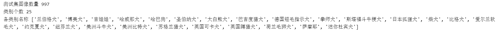

# 4.在新数据集中进行图像分类预测

本次的任务学习主要是学到了如何将一个新的图片/视频/摄像头内容进行分类预测，我在之前任务学习的基础上结合自己上学期期末作业中自己搭建的简易的七层卷积神经网络的模型，完成了图像分类预测任务。此次的笔记内容从构建数据集开始一直到最后的Grad-CAM热力图的可解释性可视化分析，我将带领大家从头到尾回顾我的学习任务。

实验完整代码在：[dog25图像分类预测代码](https://github.com/lyc686/datawhale_study/blob/main/code/fruit81-4/dog25%E5%88%86%E7%B1%BB_2.ipynb)

## 一、数据集准备

本次的学习任务，我使用的是在`kaggle`上就可以直接找到的一个**25类的宠物狗**的数据集，数据集我放在了网盘里面，链接如下：

[dog25数据集](https://pan.baidu.com/s/1tPCIau-rHqs4Vo6iBmECtQ?pwd=myup )

**提取码：myup**

也可以使用前面任务一的笔记中提到的从**百度图库**中，按照自己需要的关键词搜索爬取所需图片的方式制作自己的专属数据集。

本次实验使用的数据集是**未划分的原始数据集**。

实验环境是：[云GPU平台Featurize](https://featurize.cn/?s=d7ce99f842414bfcaea5662a97581bd1)，使用的是RTX3060的设备。

## 二、训练集、测试集划分

### 1.查看原始数据集

#### （1）查看树状文件目录

云GPU平台是linux的环境，所以可以使用 **！**+ 一些linux的指令。

```python
!sudo snap install tree
!tree ./dataset -L 2
```


#### （2）获取数据集所有类别名称

```python
import os

# 指定数据集路径
dataset_path = './dataset/dog25'
os.chdir(dataset_path)
print("len:", len(os.listdir()))
print(os.listdir())
```


这里我们发现类别是26比我们数据集多一类，这就是因为在任务一笔记中提到的在程序执行过程中自动生成的文件`.ipynb_checkpoints`，这个文件会影响我们后续的一些读取使用，所以我们需要把该文件删除，代码指令见（6）删除多余文件。

#### （3）导入工具包

整个实验所需的全部工具包都放在这里，后续如果需要添加也在这里添加

```python
import torch
import torchvision
import torch.nn.functional as F

import numpy as np
import pandas as pd

import shutil
import os

import matplotlib
import matplotlib.pyplot as plt
%matplotlib inline

# 导入pillow字体
from PIL import Image, ImageFont, ImageDraw

# 忽略烦人的红色提示
import warnings
warnings.filterwarnings("ignore")

# 随机数和python函数库
import random
import math

# 进度条
from tqdm import tqdm

# cv库
import cv2 as cv

# 可视化数据集分布使用
from scipy.stats import gaussian_kde
from matplotlib.colors import LogNorm

# 定义数据读取dataset+dataloader
from torchvision import datasets
from torch.utils.data import DataLoader

# 自定义卷积模型使用的工具包
from torchvision import models
import torch.optim as optim
import torch.nn as nn
import torchvision.transforms as transforms

from torch.utils.data import ConcatDataset, DataLoader, Subset, Dataset
from torchvision.datasets import DatasetFolder, VisionDataset


# 有 GPU 就用 GPU，没有就用 CPU
device = torch.device('cuda:0' if torch.cuda.is_available() else 'cpu')
```

#### （4）设置matplotliba中文字体

由于matplotlib绘图只能绘制英文字体，中文字体绘制会出现小方框，所以我们需要导入一个中文字体的包`SimHei`

```python
# Linux操作系统，例如 云GPU平台：https://featurize.cn/?s=d7ce99f842414bfcaea5662a97581bd1
# 如果遇到 SSL 相关报错，重新运行本代码块即可
!wget https://zihao-openmmlab.obs.cn-east-3.myhuaweicloud.com/20220716-mmclassification/dataset/SimHei.ttf -O /environment/miniconda3/lib/python3.7/site-packages/matplotlib/mpl-data/fonts/ttf/SimHei.ttf
!rm -rf /home/featurize/.cache/matplotlib

import matplotlib
matplotlib.rc("font",family='SimHei') # 中文字体
```

测试效果如下：

```python
plt.plot([1,2,3], [100,500,300])
plt.title('matplotlib中文字体测试', fontsize=25)
plt.xlabel('X轴', fontsize=15)
plt.ylabel('Y轴', fontsize=15)
plt.show()
```


#### （5）导入pillow中文字体

```python
from PIL import Image, ImageFont, ImageDraw
# 导入中文字体，指定字号
font = ImageFont.truetype('SimHei.ttf', 32)
```

#### （6）删除多余文件

```python
!for i in `find . -iname '__MACOSX'`; do rm -rf $i;done
```

```python
!for i in `find . -iname '.DS_Store'`; do rm -rf $i;done
```

```python
!for i in `find . -iname '.ipynb_checkpoints'`; do rm -rf $i;done
```

### 2.划分训练集、测试集

由于我们下载下来的数据集并不是符合我们预期的形式，所以我们需要手动的自行对其进行训练集和测试集的划分，在我的实验中，是按照**8:2**进行划分的。

具体步骤如下：

1. 创建训练集、测试集文件夹
2. 划分训练集、测试集，移动文件
3. 查看树状文件结构


### 3.查看训练集、测试集数据尺寸分布

在后续使用模型的时候我们涉及到数据的预处理部分，也就是使得我们的输入数据更加统一，尺寸固定和后续模型的参数进行匹配。

#### （1）查看训练集图片尺寸分布

首先我们使用`pandas`进行数据的读取，使用pandas的好处是，可以使用自己可控的表格的形式处理excel表格类型的数据。

```python
df_train = pd.DataFrame()
for dog in tqdm(os.listdir()): # 遍历每个类别
    os.chdir(dog)
    for file in os.listdir(): # 遍历每张图像
        try:
            img = cv.imread(file)
            df_trai = df_trai.append({'类别':dog, '文件名':file, '图像宽':img.shape[1], '图像高':img.shape[0]}, ignore_index=True)
        except:
            print(os.path.join(dog, file), '读取错误')
    os.chdir('../')
os.chdir('../')
```


通过可视化训练集中的图像尺寸分布，我们可以观察到图片尺寸分布的集中情况。


#### （2）查看测试集图片尺寸分布

同理我们可以可视化出测试集中的图像尺寸分布情况。


### 4.图像预处理（RCTN）

数据预处理RCTN其实就是基本的四部曲：

* R - 缩放裁剪
* C - 图像增强
* T - 转 Tensor
* N - 归一化

```python
# 训练集图像预处理：缩放裁剪、图像增强、转 Tensor、归一化
train_transform = transforms.Compose([transforms.RandomResizedCrop(256),
                                      transforms.RandomHorizontalFlip(),
                                      transforms.ToTensor(),
                                      transforms.Normalize([0.485, 0.456, 0.406], [0.229, 0.224, 0.225])
                                     ])

# 测试集图像预处理-RCTN：缩放、裁剪、转 Tensor、归一化
test_transform = transforms.Compose([transforms.Resize(300),
                                     transforms.CenterCrop(256),
                                     transforms.ToTensor(),
                                     transforms.Normalize(
                                         mean=[0.485, 0.456, 0.406], 
                                         std=[0.229, 0.224, 0.225])
                                    ])
```

这里我是用的图片尺寸我是用的是256*256，考虑到我自己后面提到的搭建的七层卷积模型，所以使用的是可视化出来的数据尺寸分布结果300附近的2的倍数。

### 5.定义数据读入（Dataset+Dataloader）

数据读入主要包含两部分内容：

* Dataset：完成数据读入功能
* Dataloader：定义数据读取的批次大小以及读入方式

```python
from torchvision import datasets

# 载入训练集
train_dataset = datasets.ImageFolder(train_path, train_transform)

# 载入测试集
test_dataset = datasets.ImageFolder(test_path, test_transform)

print('训练集图像数量', len(train_dataset))
print('类别个数', len(train_dataset.classes))
print('各类别名称', train_dataset.classes)

print('测试集图像数量', len(test_dataset))
print('类别个数', len(test_dataset.classes))
print('各类别名称', test_dataset.classes)
```




```python
BATCH_SIZE = 32

# 训练集的数据加载器
train_loader = DataLoader(train_dataset,
                          batch_size=BATCH_SIZE,
                          shuffle=True,
                          num_workers=4
                         )

# 测试集的数据加载器
test_loader = DataLoader(test_dataset,
                         batch_size=BATCH_SIZE,
                         shuffle=False,
                         num_workers=4
                        )
```

这里我们设置一批读取32张图片，`shuffle = True`表示随机读取，`num_worders = 4`表示使用4个线程进行同时读取，如果在cpu上实验我建议将num_worders设置为0，否则会报错。

### 6.类别和索引号一一对应

完成类别和索引号一一对应对后续的数据处理方面有很多的遍历。

```python
# 各类别名称
class_names = train_dataset.classes
n_class = len(class_names)
print(class_names)

# 映射关系：类别 到 索引号
train_dataset.class_to_idx

# 映射关系：索引号 到 类别
idx_to_labels = {y:x for x,y in train_dataset.class_to_idx.items()}
idx_to_labels
```


## 三、可视化一个batch中图像和标注

完成了上面的数据集划分、数据预处理、数据读入方式之后我们就可以开始读取一个batch，也就是一个批次（当前为32张图一个批次）的图像结果，并且可视化出来。

```python
# DataLoader 是 python生成器，每次调用返回一个 batch 的数据
# 从训练集中读取一个批次
images, labels = next(iter(train_loader))

print(images.shape)
print(labels)

# 从测试集中读取一个批次
images2, labels2 = next(iter(test_loader))

print(images2.shape)
print(labels2)
```


我们可以观察到由于数据预处理的操作，我们的图片尺寸都变成了3通道的256*256的图片，并且对应的类别用之前定义的**类别--索引号**对应，由于测试集暂时没有进行预测所以没有类别。

同时我们还可以从一个batch中取出一张图片查看图片的像素分布情况以及图片可视化。

```python
# 将数据集中的Tensor张量转为numpy的array数据类型
images = images.numpy()

# 取出第六张图
print(images[5].shape)

# # 输出读入的第6张图片的像素分布（transform归一化之后的）
plt.hist(images[5].flatten(), bins=50)
plt.show()

# batch 中经过预处理的图像
idx = 5
plt.imshow(images[idx].transpose((1,2,0))) # 转为(224, 224, 3)
plt.title('label:'+str(labels[idx].item()))

# 原始图像
idx = 5
mean = np.array([0.485, 0.456, 0.406])
std = np.array([0.229, 0.224, 0.225])
plt.imshow(np.clip(images[idx].transpose((1,2,0)) * std + mean, 0, 1))
plt.title('label:'+ pred_classname)
plt.show()
```


## 四、复用自定义卷积模型

这里实验我没有用`resnet18`或者`resnet50`等，pytorch里自带的模型，而是使用的我自己搭建的简单的七层卷积神经网络模型，包括前四层的卷积层用来做特征提取，后三层的全连接层用来加强神经元之间的联系并得到最终的分类结果。

```python
from torch import nn
class Classify(nn.Module):
    def __init__(self):
        super(Classify, self).__init__()
        
        # Input图片是3*256*256
        self.layer1 = nn.Sequential(
            nn.Conv2d(3, 64, 3, 1, 1), # 64*256*256
            nn.BatchNorm2d(64),
            nn.ReLU(),
            nn.MaxPool2d(2, 2, 0) # 64*128*128
        )

        self.layer2 = nn.Sequential(
            nn.Conv2d(64, 128, 3, 1, 1), # 128*128*128
            nn.BatchNorm2d(128),
            nn.ReLU(),
            nn.MaxPool2d(2, 2, 0) # 128*64*64
        )

        self.layer3 = nn.Sequential(
            nn.Conv2d(128, 256, 3, 1, 1), # 256*64*64
            nn.BatchNorm2d(256),
            nn.ReLU(),
            nn.MaxPool2d(2, 2, 0) #256*32*32
        )

        self.layer4 = nn.Sequential(
            nn.Conv2d(256, 512, 3, 1, 1), # 512*32*32
            nn.BatchNorm2d(512),
            nn.ReLU(),
            nn.MaxPool2d(2, 2, 0) # 512*16*16
        )
       
        # 定义全连接部分
        self.fc1 = nn.Sequential(
            nn.Linear(512*16*16,512),
            nn.ReLU()
        )

        self.fc2 = nn.Sequential(
            nn.Linear(512, 256),
            nn.ReLU()
        )

        self.fc3 = nn.Sequential(
            nn.Linear(256, 11)
        )
        

    def forward(self, x):

        x1 = self.layer1(x)        
        x2 = self.layer2(x1)    
        x3 = self.layer3(x2)     
        x4 = self.layer4(x3)
   
        xf1 = x4.flatten(1)
        #xf1 = xf1.view(xf1.size()[0],-1)
        xf2 = self.fc1(xf1)
        xf3 = self.fc2(xf2)

        result = self.fc3(xf3)
               
        return result
```

具体的模型样式我们可以使用`tensorboardX`进行可视化出来。


在应用到我们的`dog25`数据集上之前，由于之前的任务做的是11种食品的分类任务，和当前数据集没有交集，所以我们选择对于当前模型的所有部分的权重进行重新的训练。

```python
model = Classify().to(device)
print(model.fc3)

model = Classify().to(device) # 载入预训练模型
model.fc3 = nn.Linear(model.fc3[0].in_features, n_class)
optimizer = optim.Adam(model.parameters())

print(model.fc3)
```


可以打印最后一层的结构发现已经由最终进行11分类变成了25分类。

## 五、在数据集上训练

当我们模型定义完成后我们就可以将数据集导入模型进行训练，由于我自己搭建的模型确实比较简单，而且数据集的大小也不是很大，所以当我使用该模型的时候虽然在之前期末的11类食品的数据集上取得了很好的效果，但是在25类宠物狗的数据集中效果并没有很好。

使用的是**交叉熵损失函数**和**Adam的优化器**。

```python
model = model.to(device)

# 交叉熵损失函数
criterion = nn.CrossEntropyLoss() 

# 训练轮次 Epoch
EPOCHS = 30

# 连续5次准确率低于最优出现过拟合，停止训练
patience = 20
# 初始最好的准确率设定为0
best_acc = 0.0
stale = 0
```

进行了多轮的实验最终分类效果如下：

| 训练轮数 | 训练集准确率 | 测试集准确率 |
| :------: | :----------: | :----------: |
|    20    |     24%      |     16%      |
|    80    |     58%      |     56%      |
|  140轮   |     64%      |     60%      |
|  170轮   |     71%      |     67%      |
|  200轮   |     85%      |     70%      |

可以看到最后的效果勉强还可以能达到70%，在之后运行的话超过两百轮就会有过拟合情况出现。

实验完成后我们将模型保存，一般pytorch模型用`.pth`保存，tensorflow模型用`.ckpt`保存。

```python
torch.save(model, './checkpoints/dog25_pytorch_20230122.pth')
```

## 六、在新图片上预测

完成模型训练的全部工作之后，我们将一张全新的图片输入到模型中进行预测，并可视化预测的Grad-CAM热力图查看他的关注点在哪里，从而完成可解释性分析。

```python
# 导入模型
model = torch.load('checkpoints/dog25_pytorch_20230122.pth')
model = model.eval().to(device)
img_path = './dataset/test/萨摩耶1.jpg'
img_pil = Image.open(img_path)

# 查看原图尺寸
print(np.array(img_pil).shape)

# 打印原图
print(img_pil)

# 修改尺寸（不然太大屏幕放不下）
img_pil_resize = img_pil.resize((1200,800))
```


然后按照前向预测的流程对图片进行预测，预测结束后输出对应所有类别的预测分数。

```python
input_img = test_transform(img_pil) # 预处理
input_img = input_img.unsqueeze(0).to(device)
# 执行前向预测，得到所有类别的 logit 预测分数
pred_logits = model(input_img) 
print(pred_logits)
pred_softmax = F.softmax(pred_logits, dim=1) # 对 logit 分数做 softmax 运算
print(pred_softmax)
```


同时我们可以从25个预测概率中取出前10个置信度最高的值，将其绘制在原图上，并且输出柱状图进行可视化。

```python
n = 10
top_n = torch.topk(pred_softmax, n) # 取置信度最大的 n 个结果
pred_ids = top_n[1].cpu().detach().numpy().squeeze() # 解析出类别
confs = top_n[0].cpu().detach().numpy().squeeze() # 解析出置信度

draw = ImageDraw.Draw(img_pil_resize)

for i in range(n):
    class_name = idx_to_labels[pred_ids[i]] # 获取类别名称
    confidence = confs[i] * 100 # 获取置信度
    text = '{:<15} {:>.4f}'.format(class_name, confidence)
    print(text)
    
    # 文字坐标，中文字符串，字体，rgba颜色
    draw.text((50, 100 + 50 * i), text, font=font, fill=(255, 0, 0, 1))
    
fig = plt.figure(figsize=(18,6))

# 绘制左图-预测图
ax1 = plt.subplot(1,2,1)
ax1.imshow(img_pil)
ax1.axis('off')

# 绘制右图-柱状图
ax2 = plt.subplot(1,2,2)
x = idx_to_labels.values()
y = pred_softmax.cpu().detach().numpy()[0] * 100
ax2.bar(x, y, alpha=0.5, width=0.3, color='yellow', edgecolor='red', lw=3)
plt.bar_label(ax, fmt='%.2f', fontsize=10) # 置信度数值

plt.title('{} 图像分类预测结果'.format(img_path), fontsize=30)
plt.xlabel('类别', fontsize=20)
plt.ylabel('置信度', fontsize=20)
plt.ylim([0, 110]) # y轴取值范围
ax2.tick_params(labelsize=16) # 坐标文字大小
plt.xticks(rotation=90) # 横轴文字旋转

plt.tight_layout()
fig.savefig('output/预测图+柱状图.jpg')
```


如果用表格输出预测结果：

```python
pred_df = pd.DataFrame() # 预测结果表格
for i in range(n):
    class_name = idx_to_labels[pred_ids[i]] # 获取类别名称
    label_idx = int(pred_ids[i]) # 获取类别号
    confidence = confs[i] * 100 # 获取置信度
    pred_df = pred_df.append({'Class':class_name, 'Class_ID':label_idx, 'Confidence(%)':confidence}, ignore_index=True) # 预测结果表格添加一行
display(pred_df) # 展示预测结果表格
```


同时我还测试了另外的很多张张图片，大部分效果还可以，但是也有相当一部分结果不是很准确。


准确的判断出来这是一只柴犬。

## 七、Grad-CAM热力图分析

由于最终的测试结果是如何得出的我们并不得而知，所以我们考虑使用一些可解释性的手段对模型进行分析，从而去学习模型是如何得到最终的结果了。使用`Grad-CAM`而不是使用`CAM`的好处在于不需要对模型的最后一层全连接部分修改为`GAP`。

我们依旧对上面测试的萨摩耶的图片进行可解释性分析，将图片导入Grad-CAM进行分析，指定分析类别为萨摩耶的分析类别23。

```python
from pytorch_grad_cam import GradCAM
import torchcam
from torchcam.utils import overlay_mask

# 如果 targets 为 None，则默认为最高置信度类别
targets = [ClassifierOutputTarget(23)]
# 萨摩耶为23
# '兰伯格犬': 0,
#  '博美犬': 1,
#  '吉娃娃': 2,
#  '哈威那犬': 3,
#  '哈巴狗': 4,
#  '圣伯纳犬': 5,
#  '大白熊犬': 6,
#  '巴吉度猎犬': 7,
#  '德国短毛指示犬': 8,
#  '拳师犬': 9,
#  '斯塔福斗牛梗犬': 10,
#  '日本狐狸犬': 11,
#  '柴犬': 12,
#  '比格犬': 13,
#  '爱尔兰软毛犬': 14,
#  '约克夏犬': 15,
#  '纽芬兰犬': 16,
#  '美洲斗牛犬': 17,
#  '美洲比特犬': 18,
#  '苏格兰猎犬': 19,
#  '英国可卡犬': 20,
#  '英国蹲猎犬': 21,
#  '荷兰毛狮犬': 22,
#  '萨摩耶': 23,
#  '迷你杜宾犬': 24

# 确定待分析的层为最后一层
model.layer4

# Grad-CAM
from pytorch_grad_cam import GradCAM
target_layers = [model.layer4[-1]]
cam = GradCAM(model=model, target_layers=target_layers, use_cuda=True)

# 生成热力图
cam_map = cam(input_tensor=input_tensor, targets=targets)[0] # 不加平滑

# 可视化热力图
plt.imshow(cam_map)
plt.show()

# 将热力图通过放缩和原图重叠在一起
result = overlay_mask(img_pil, Image.fromarray(cam_map), alpha=0.6) # alpha越小，原图越淡
print(result)
```


我们发现最后一层关注的点在于宠物狗的眼睛部分，也就是通过提取眼睛这部分的信息来判断是什么品种的宠物狗，这种特征我们也可以将其称为**语义**。而且使用Grad-CAM我们同时也可以对其他层的关注点进行分析可视化，往往越靠近最后的层语义特征越明显，但是由于我这个模型比较简单，可视化每一层结果都差不多QAQ。

## 使用建议

### 1.云GPU平台

由于云GPU平台只能在work路径下保存自己的实验数据，所以建议大家都在work路径里面去进行实验，当然可以在work路径里面去新建自己的文件夹。同时我在实验的时候用本机跑（无nvidia的gpu）运行速度非常慢，还会时不时死机，所以建议大家还是在云GPU平台上运算比较便捷。同时也可以学习到一个linux的指令。

### 2.分割数据集

这部分建议一定要手敲或者跑一遍代码，然后理解它里面是怎么划分和保存的，不然自己实际划分的时候会报各种各样的错误，比如我开始没有仔细看代码，然后运行的时候，本来还想和原数据集对比一下，然后发现原数据集已经被删除了。

### 3.复用模型

如果你也是用的自己的模型进行复用的话，一定要配套的修改一下自己模型中的一些参数，比如原来模型中读取的图片尺寸和当前读取图片尺寸不一致时需要修改对应层的输入参数，一致当然就不用修改了，而且对于是否全局微调参数里的`pretrained`如果自己的模型没有定义这个的话，就直接空着就好了。

### 4.CAM热力图可视化

由于CAM热力图可视化需要修改最后一层全连接为GAP，如果不是很行自己尝试的小伙伴直接无脑使用Grad-CAM即可。由于我在实验的时候，大佬的github仓库克隆在云GPU平台无法完成，所以我选择从大佬代码讲解部分的github仓库直接克隆到本地，然后上传压缩包到云GPU平台，再解压缩，使用效果是一样的。

压缩包我放在这里，直接下载使用也可以：[torch-cam](https://github.com/lyc686/datawhale_study/blob/main/dataset/torch-cam.zip)


