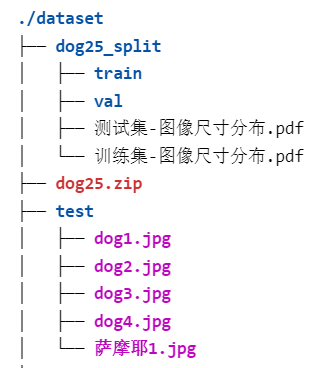
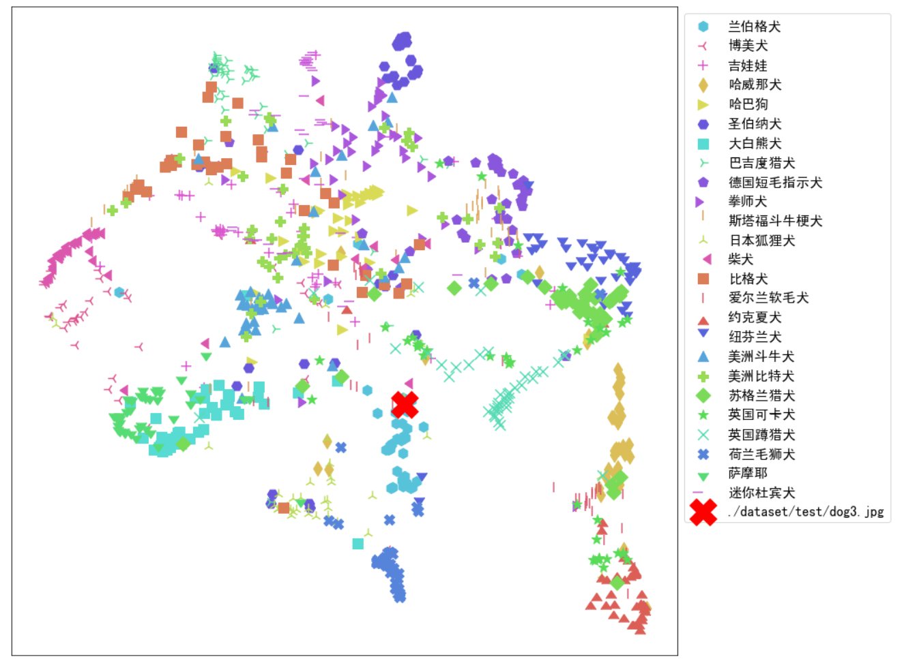

# 5.在测试集上进行模型性能评估

## 学习来源

本次的任务实践是的跟着子豪兄的学习视频：[B站视频](https://space.bilibili.com/1900783)

子豪兄提供的完整代码：[代码](https://github.com/TommyZihao/Train_Custom_Dataset)

实验环境就是在子豪兄推荐的云GPU平台上进行的：[云GPU平台Featurize](https://featurize.cn/?s=d7ce99f842414bfcaea5662a97581bd1)。

我的完整代码在：[任务5代码]([datawhale_study/code/fruit81-5 at main · lyc686/datawhale_study (github.com)](https://github.com/lyc686/datawhale_study/tree/main/code/fruit81-5))

## 一、查看数据集

此次的任务我们仍然使用第四次任务时使用的25类宠物狗的数据集。

详情见：[任务4笔记](https://github.com/lyc686/datawhale_study/blob/main/classify_with_pytorch/4.New_picture_classify.md)

### 1.树状的文件目录

通过使用树状的形式我们可以显示出我们文件的数据集存储情况，以便于后续路径的选取。

```python
!sudo snap install tree
!tree ./dataset -L 2
```



### 2.获取数据集所有类别名称

```python
import os

# 指定数据集路径
dataset_path = './dataset/dog25_split/train'
os.chdir(dataset_path)
print("len:", len(os.listdir()))
print(os.listdir())
```


### 3.设置中文字体

因为pytorch的matplotlib不支持中文字体，所以我们需要自己单独导入中文字体。

包括：

* matplotlib字体
* pillow字体

```python
# Linux操作系统，例如 云GPU平台：https://featurize.cn/?s=d7ce99f842414bfcaea5662a97581bd1
# 如果遇到 SSL 相关报错，重新运行本代码块即可
!wget https://zihao-openmmlab.obs.cn-east-3.myhuaweicloud.com/20220716-mmclassification/dataset/SimHei.ttf -O /environment/miniconda3/lib/python3.7/site-packages/matplotlib/mpl-data/fonts/ttf/SimHei.ttf
!rm -rf /home/featurize/.cache/matplotlib

import matplotlib
matplotlib.rc("font",family='SimHei') # 中文字体
```

```python
from PIL import Image, ImageFont, ImageDraw
# 导入中文字体，指定字号
font = ImageFont.truetype('SimHei.ttf', 32)
```

同时可以测试中文字体是否导入成功

```python
plt.plot([1,2,3], [100,500,300])
plt.title('matplotlib中文字体测试', fontsize=25)
plt.xlabel('X轴', fontsize=15)
plt.ylabel('Y轴', fontsize=15)
plt.show()
```


## 二、预测每张图像的分类预测结果以及各个类别的置信度

### 1.载入测试集

```python
# 数据集文件夹路径
dataset_dir = './dataset/dog25_split'
test_path = os.path.join(dataset_dir, 'val')
from torchvision import datasets
# 载入测试集
test_dataset = datasets.ImageFolder(test_path, test_transform)
print('测试集图像数量', len(test_dataset))
print('类别个数', len(test_dataset.classes))
print('各类别名称', test_dataset.classes)
# 载入类别名称 和 ID索引号 的映射字典
idx_to_labels = np.load('idx_to_labels.npy', allow_pickle=True).item()
# 获得类别名称
classes = list(idx_to_labels.values())
print(classes)
```


### 2.导入训练好的模型

这里使用的时之前任务学习中已经在训练集中完成了参数更新的模型。

之前的训练效果如下表所示：

| 训练轮数 | 训练集准确率 | 测试集准确率 |
| :------: | :----------: | :----------: |
|    20    |     24%      |     16%      |
|    80    |     58%      |     56%      |
|  140轮   |     64%      |     60%      |
|  170轮   |     71%      |     67%      |
|  200轮   |     85%      |     70%      |

```python
model = torch.load('checkpoints/dog25_pytorch_20230122.pth')
model = model.eval().to(device)
```

### 3.标记图像路径，存储在表格A中

```python
img_paths = [each[0] for each in test_dataset.imgs]
df = pd.DataFrame()
df['图像路径'] = img_paths
df['标注类别ID'] = test_dataset.targets
df['标注类别名称'] = [idx_to_labels[ID] for ID in test_dataset.targets]
```


### 4.将测试集图像预测结果以及各类置信度，存储在表格B中

```python
# 记录 top-n 预测结果
n = 3
df_pred = pd.DataFrame()
for idx, row in tqdm(df.iterrows()):
    img_path = row['图像路径']
    img_pil = Image.open(img_path).convert('RGB')
    input_img = test_transform(img_pil).unsqueeze(0).to(device) # 预处理
    pred_logits = model(input_img) # 执行前向预测，得到所有类别的 logit 预测分数
    pred_softmax = F.softmax(pred_logits, dim=1) # 对 logit 分数做 softmax 运算

    pred_dict = {}

    top_n = torch.topk(pred_softmax, n) # 取置信度最大的 n 个结果
    pred_ids = top_n[1].cpu().detach().numpy().squeeze() # 解析出类别
    
    # top-n 预测结果
    for i in range(1, n+1):
        pred_dict['top-{}-预测ID'.format(i)] = pred_ids[i-1]
        pred_dict['top-{}-预测名称'.format(i)] = idx_to_labels[pred_ids[i-1]]
    pred_dict['top-n预测正确'] = row['标注类别ID'] in pred_ids
    # 每个类别的预测置信度
    for idx, each in enumerate(classes):
        pred_dict['{}-预测置信度'.format(each)] = pred_softmax[0][idx].cpu().detach().numpy()
        
    df_pred = df_pred.append(pred_dict, ignore_index=True)
```


### 5.拼接表格A、B

```python
df = pd.concat([df, df_pred], axis=1)
```


### 6.载入图像名称以及id

```python
idx_to_labels = np.load('idx_to_labels.npy', allow_pickle=True).item()
# 获得类别名称
classes = list(idx_to_labels.values())
print(classes)
```

## 三、各类评价指标

将我们所需的所有测试集的预测结果信息存储在pandas的表格中后，就可以使用各种评价指标进行评估。

### 1.acc准确率

```python
sum(df['标注类别名称'] == df['top-1-预测名称']) / len(df)
```


### 2.top-n准确率

```python
sum(df['top-n预测正确']) / len(df)
```


### 3.macro avg宏平均

宏平均：直接将每一类的评估指标求和取平均（算数平均值）

```python
# 计算 宏平均准确率
acc_macro = np.mean(accuracy_list)
acc_weighted = sum(accuracy_list * df_report.iloc[:-2]['support'] / len(df))
```


### 4.weighted avg加权平均

加权平均：按样本数量（support）加权计算评估指标的平均值。

```python
# 计算 加权平均准确率
accuracy_list.append(acc_macro)
accuracy_list.append(acc_weighted)
```


### 5.recall召回率

```python
from sklearn.metrics import classification_report
print(classification_report(df['标注类别名称'], df['top-1-预测名称'], target_names=classes))
```

使用`classification_report()`函数我们就可以算出各式各样的指标，其中也包括召回率。


有关classification_report()函数可以参考博客：https://blog.csdn.net/weixin_48964486/article/details/122881350

## 四、混淆矩阵

混淆矩阵可以很清晰的观察出来**真实类别**和**预测类别**的情况。

### 1.生成混淆矩阵

```python
from sklearn.metrics import confusion_matrix
confusion_matrix_model = confusion_matrix(df['标注类别名称'], df['top-1-预测名称'])
confusion_matrix_model
```


### 2.可视化混淆矩阵

更加直观的方式是将混淆矩阵通过绘图绘制出来

```python
import itertools
def cnf_matrix_plotter(cm, classes, cmap=plt.cm.Blues):
    """
    传入混淆矩阵和标签名称列表，绘制混淆矩阵
    """
    plt.figure(figsize=(10, 10))
    
    plt.imshow(cm, interpolation='nearest', cmap=cmap)
    # plt.colorbar() # 色条
    tick_marks = np.arange(len(classes))
    
    plt.title('混淆矩阵', fontsize=30)
    plt.xlabel('预测类别', fontsize=25, c='r')
    plt.ylabel('真实类别', fontsize=25, c='r')
    plt.tick_params(labelsize=16) # 设置类别文字大小
    plt.xticks(tick_marks, classes, rotation=90) # 横轴文字旋转
    plt.yticks(tick_marks, classes)
    
    # 写数字
    threshold = cm.max() / 2.
    for i, j in itertools.product(range(cm.shape[0]), range(cm.shape[1])):
        plt.text(j, i, cm[i, j],
                 horizontalalignment="center",
                 color="white" if cm[i, j] > threshold else "black",
                 fontsize=12)

    plt.tight_layout()

    plt.savefig('混淆矩阵.pdf', dpi=300) # 保存图像
    plt.show()

cnf_matrix_plotter(confusion_matrix_model, classes, cmap='Blues')
```


图中对角线部分即为预测正确的部分，从图中我们可以看到**兰伯格犬、约克夏犬、荷兰毛狮犬**的预测正确数量很客观，而**吉娃娃、拳师犬、美洲比特犬**的预测准确率不高。

```python
# 查看所有配色方案
# dir(plt.cm)

# 子豪兄精选配色方案
# Blues
# BuGn
# Reds
# Greens
# Greys
# binary
# Oranges
# Purples
# BuPu
# GnBu
# OrRd
# RdPu
```

### 3.查看预测错误的图像

根据混淆矩阵我们不难看出各类图像的分类情况，所以我们可以有针对性的查看分类错误的图像，这里以将**美洲比特犬**错分类为**斯塔福斗牛梗犬**为例。

```python
true_A = '美洲比特犬'
pred_B = '斯塔福斗牛梗犬'

wrong_df = df[(df['标注类别名称']==true_A)&(df['top-1-预测名称']==pred_B)]
wrong_df
```


可视化被误判的图片

```python
for idx, row in wrong_df.iterrows():
    img_path = row['图像路径']
    img_bgr = cv.imread(img_path)
    img_rgb = cv.cvtColor(img_bgr, cv.COLOR_BGR2RGB)
    plt.imshow(img_rgb)
    title_str = img_path + '\nTrue:' + row['标注类别名称'] + ' Pred:' + row['top-1-预测名称']
    plt.title(title_str)
    plt.show()
```


这里我们发现确实有点像斯塔福斗牛梗犬，我从百度图库找了一些图片：[斯塔福斗牛梗犬_百度图片搜索 (baidu.com)](https://image.baidu.com/search/index?tn=baiduimage&ipn=r&ct=201326592&cl=2&lm=-1&st=-1&fm=index&fr=&hs=0&xthttps=111110&sf=1&fmq=&pv=&ic=0&nc=1&z=&se=1&showtab=0&fb=0&width=&height=&face=0&istype=2&ie=utf-8&word=斯塔福斗牛梗犬&oq=斯塔福斗牛梗犬&rsp=-1)

## 五、PR曲线、ROC曲线

### 1.PR曲线

PR曲线中的P代表的是precision（精准率），R代表的是recall（召回率），其代表的是精准率与召回率的关系，一般情况下，将recall设置为横坐标，precision设置为纵坐标。

precision（精准率）和recall（召回率）
上述中介少了PR曲线的实质代表为precision（精准率）和recall（召回率），但是这二者是什么呢？下面咱们进行相关的讲述。
首先，结合前面混淆矩阵中的概念，如下表。


其中，把正例正确地分类为正例，表示为TP（true positive），把正例错误地分类为负例，表示为FN（false negative）。把负例正确地分类为负例，表示为TN（true negative）， 把负例错误地分类为正例，表示为FP（false positive）。
从混淆矩阵可以得出精准率与召回率：
precision = TP/(TP + FP)
recall = TP/(TP +FＮ)

```python
specific_class = '柴犬'
# 二分类标注
y_test = (df['标注类别名称'] == specific_class)
# 二分类预测置信度
y_score = df['柴犬-预测置信度']
from sklearn.metrics import precision_recall_curve
from sklearn.metrics import average_precision_score
precision, recall, thresholds = precision_recall_curve(y_test, y_score)
AP = average_precision_score(y_test, y_score, average='weighted')
print(AP) # AP为PR曲线下的面积
```


这里我们以**柴犬**类别为例绘制PR曲线。

```python
plt.figure(figsize=(12, 8))
# 绘制 PR 曲线
plt.plot(recall, precision, linewidth=5, label=specific_class)

# 随机二分类模型
# 阈值小，所有样本都被预测为正类，recall为1，precision为正样本百分比
# 阈值大，所有样本都被预测为负类，recall为0，precision波动较大
plt.plot([0, 0], [0, 1], ls="--", c='.3', linewidth=3, label='随机模型')
plt.plot([0, 1], [0.5, sum(y_test==1)/len(df)], ls="--", c='.3', linewidth=3)

plt.xlim([-0.01, 1.0])
plt.ylim([0.0, 1.01])
plt.rcParams['font.size'] = 22
plt.title('{} PR曲线  AP:{:.3f}'.format(specific_class, AP))
plt.xlabel('Recall')
plt.ylabel('Precision')
plt.legend()
plt.grid(True)
plt.savefig('{}-PR曲线.pdf'.format(specific_class), dpi=120, bbox_inches='tight')
plt.show()
```


PR曲线越靠右上角，即曲线下方面积越大，我们的预测准确率越高。同时如果A曲线能够**包住**B曲线，那么我们就可以说A曲线优于B曲线，但是如果有曲线之间交叉的话就不好评判优劣。

如果绘制各类别的PR曲线结果如下图所示：


### 2.ROC曲线

以FPR为横坐标、TPR为纵坐标，将每一个阈值所对应的(FPR,TPR)放入坐标系中。用红色线条将所有的点连接起来——此即为**ROC曲线**。

这里我们以**大白熊犬**类别为例，绘制该类别的ROC曲线。

```python
specific_class = '大白熊犬'
# 二分类标注
y_test = (df['标注类别名称'] == specific_class)
# 二分类置信度
y_score = df['大白熊犬-预测置信度']
from sklearn.metrics import roc_curve, auc
fpr, tpr, threshold = roc_curve(y_test, y_score)
plt.figure(figsize=(12, 8))
plt.plot(fpr, tpr, linewidth=5, label=specific_class)
plt.plot([0, 1], [0, 1],ls="--", c='.3', linewidth=3, label='随机模型')
plt.xlim([-0.01, 1.0])
plt.ylim([0.0, 1.01])
plt.rcParams['font.size'] = 22
plt.title('{} ROC曲线  AUC:{:.3f}'.format(specific_class, auc(fpr, tpr)))
plt.xlabel('False Positive Rate (1 - Specificity)')
plt.ylabel('True Positive Rate (Sensitivity)')
plt.legend()
plt.grid(True)

plt.savefig('{}-ROC曲线.pdf'.format(specific_class), dpi=120, bbox_inches='tight')
plt.show()

# yticks = ax.yaxis.get_major_ticks()
# yticks[0].label1.set_visible(False)

```


```python
# AUC为ROC曲线下的面积
auc(fpr, tpr)
```


同时我们可以绘制出所有类别的ROC曲线

```python
plt.figure(figsize=(14, 10))
plt.xlim([-0.01, 1.0])
plt.ylim([0.0, 1.01])
plt.plot([0, 1], [0, 1],ls="--", c='.3', linewidth=3, label='随机模型')
plt.xlabel('False Positive Rate (1 - Specificity)')
plt.ylabel('True Positive Rate (Sensitivity)')
plt.rcParams['font.size'] = 22
plt.grid(True)

auc_list = []
for each_class in classes:
    y_test = list((df['标注类别名称'] == each_class))
    y_score = list(df['{}-预测置信度'.format(each_class)])
    fpr, tpr, threshold = roc_curve(y_test, y_score)
    plt.plot(fpr, tpr, **get_line_arg(), label=each_class)
    plt.legend()
    auc_list.append(auc(fpr, tpr))

plt.legend(loc='best', fontsize=12)
plt.savefig('各类别ROC曲线.pdf'.format(specific_class), dpi=120, bbox_inches='tight')
plt.show()
```


### 3.将AP值与AUC值放入各类指标表格中

我们将上面计算得出的AP值和AUC值对应的列存储在表格中如下图所示。

```python
df_report['AP'] = ap_list
df_report['AUC'] = auc_list
df_report.to_csv('各类别准确率评估指标.csv', index=False)
```


## 六、绘制各类别准确率评估指标柱状图

如果想要将各指标的对应数值更加直观的显示出来，我们可以选择柱状图的形式。

例如，这里我们绘制出各类别的准确率柱状图表示。

```python
# feature = 'precision'
# feature = 'recall'
# feature = 'f1-score'
feature = 'accuracy'
# feature = 'AP'
# feature = 'AUC'
df_plot = df.sort_values(by=feature, ascending=False)

plt.figure(figsize=(22, 7))

x = df_plot['类别']
y = df_plot[feature]

ax = plt.bar(x, y, width=0.6, facecolor='#1f77b4', edgecolor='k')
plt.bar_label(ax, fmt='%.2f', fontsize=15) # 置信度数值

plt.xticks(rotation=45)
plt.tick_params(labelsize=15)
# plt.xlabel('类别', fontsize=20)
plt.ylabel(feature, fontsize=20)
plt.title('准确率评估指标 {}'.format(feature), fontsize=25)

plt.savefig('各类别准确率评估指标柱状图-{}.pdf'.format(feature), dpi=120, bbox_inches='tight')

plt.show()
```


## 七、测试集图像语义特征+降维可视化

首先，我们需要使用测试集模型对图像进行语义特征提取，一般**越靠后**的层我们认为他提取的特征更加具有特殊性（更具有语义），例如提取眼睛特征、鼻子特征、嘴巴特征等等。而浅层的层提取的是比较边缘的特征，比如图片中的线段，图片中的边角等等。

所以这里我们对于自搭建的七层模型的倒数第二个全连接层进行语义特征提取。


### 1.计算单个图像的语义特征

```python
from torchvision.models.feature_extraction import create_feature_extractor
model_trunc = create_feature_extractor(model, return_nodes={'fc2': 'semantic_feature'})
img_path = './dataset/dog25_split/val/柴犬/shiba_inu_16.jpg'
img_pil = Image.open(img_path)
input_img = test_transform(img_pil) # 预处理
input_img = input_img.unsqueeze(0).to(device)
# 执行前向预测，得到指定中间层的输出
pred_logits = model_trunc(input_img) 
pred_logits['semantic_feature'].squeeze().detach().cpu().numpy().shape
```


这里我们对于**单张图像**进行语义特征提取，最终得到一个256维的向量，也就是该图片在倒数第二个全连接层之后输出的256个语义特征。

如果使用`CAM类激活热力图`我们也可以可视化查看该语义特征是什么。

### 2.计算各个类的语义特征

```python
encoding_array = []
img_path_list = []

for img_path in tqdm(df['图像路径']):
    img_path_list.append(img_path)
    img_pil = Image.open(img_path).convert('RGB')
    input_img = test_transform(img_pil).unsqueeze(0).to(device) # 预处理
    feature = model_trunc(input_img)['semantic_feature'].squeeze().detach().cpu().numpy() # 执行前向预测，得到 avgpool 层输出的语义特征
    encoding_array.append(feature)
encoding_array = np.array(encoding_array)
encoding_array.shape
```


### 1.t-SNE降维可视化

抽取Pytorch训练得到的图像分类模型中间层的输出特征，作为输入图像的语义特征。<font color="blue">注意：t-SNE降维可视化每次只能一次性加载数据生成结果，当有新数据来临时，需要将全部数据再次重新进行绘图。</font>

#### （1）二维降维可视化

```python
import seaborn as sns
marker_list = ['.', ',', 'o', 'v', '^', '<', '>', '1', '2', '3', '4', '8', 's', 'p', 'P', '*', 'h', 'H', '+', 'x', 'X', 'D', 'd', '|', '_', 0, 1, 2, 3, 4, 5, 6, 7, 8, 9, 10, 11]
class_list = np.unique(df['标注类别名称'])
class_list
n_class = len(class_list) # 测试集标签类别数
palette = sns.hls_palette(n_class) # 配色方案
sns.palplot(palette)
# 随机打乱颜色列表和点型列表
import random
random.seed(1234)
random.shuffle(marker_list)
random.shuffle(palette)
```


降维到二维：

```python
# 降维到二维和三维
from sklearn.manifold import TSNE

tsne = TSNE(n_components=2, n_iter=20000)
X_tsne_2d = tsne.fit_transform(encoding_array)
# 不同的 符号 表示 不同的 标注类别
show_feature = '标注类别名称'
plt.figure(figsize=(14, 14))
for idx, fruit in enumerate(class_list): # 遍历每个类别
    # 获取颜色和点型
    color = palette[idx]
    marker = marker_list[idx%len(marker_list)]

    # 找到所有标注类别为当前类别的图像索引号
    indices = np.where(df[show_feature]==fruit)
    plt.scatter(X_tsne_2d[indices, 0], X_tsne_2d[indices, 1], color=color, marker=marker, label=fruit, s=150)

plt.legend(fontsize=16, markerscale=1, bbox_to_anchor=(1, 1))
plt.xticks([])
plt.yticks([])
plt.savefig('语义特征t-SNE二维降维可视化.pdf', dpi=300) # 保存图像
plt.show()
```


观察降维可视化的图中`簇`的情况，我们可以观察到各个类别的分布情况。同一个类别的图片分布在一个相近的簇里，同时分类错误的部分也会可视化在图中。

#### （2）plotply交互式可视化

交互式可视化可以带给我们更加舒适的用户交互体验。

```python
import plotly.express as px
df_2d = pd.DataFrame()
df_2d['X'] = list(X_tsne_2d[:, 0].squeeze())
df_2d['Y'] = list(X_tsne_2d[:, 1].squeeze())
df_2d['标注类别名称'] = df['标注类别名称']
df_2d['预测类别'] = df['top-1-预测名称']
df_2d['图像路径'] = df['图像路径']
df_2d.to_csv('t-SNE-2D.csv', index=False)
fig = px.scatter(df_2d, 
                 x='X', 
                 y='Y',
                 color=show_feature, 
                 labels=show_feature,
                 symbol=show_feature, 
                 hover_name='图像路径',
                 opacity=0.8,
                 width=1000, 
                 height=600
                )
# 设置排版
fig.update_layout(margin=dict(l=0, r=0, b=0, t=0))
fig.show()
fig.write_html('语义特征t-SNE二维降维plotly可视化.html')
```

<video id="video" controls=""src="../images/t-sne.mp4" preload="none">

此时如果我们将左侧兰伯格犬的簇中分类错误的哈威那犬的图片打印出来进行对比不难发现，确实人眼也很难直接进行分辨。

```python
# 查看图像
img_path_temp = './dataset/dog25_split/val/哈威那犬/havanese_48.jpg'
img_bgr = cv.imread(img_path_temp)
img_rgb = cv.cvtColor(img_bgr, cv.COLOR_BGR2RGB)
plt.imshow(img_rgb)
temp_df = df[df['图像路径'] == img_path_temp]
title_str = img_path_temp + '\nTrue:' + temp_df['标注类别名称'].item() + ' Pred:' + temp_df['top-1-预测名称'].item()
plt.title(title_str)
plt.show()
img_path_temp = './dataset/dog25_split/val/约克夏犬/yorkshire_terrier_84.jpg'
img_bgr = cv.imread(img_path_temp)
img_rgb = cv.cvtColor(img_bgr, cv.COLOR_BGR2RGB)
plt.imshow(img_rgb)
temp_df = df[df['图像路径'] == img_path_temp]
title_str = img_path_temp + '\nTrue:' + temp_df['标注类别名称'].item() + ' Pred:' + temp_df['top-1-预测名称'].item()
plt.title(title_str)
plt.show()
```


#### （3）三维降维可视化

如果使用三维的情况进行降维可视化，结果如下图所示。

(三维图还能拖动哦~)

```python
# 降维到三维
from sklearn.manifold import TSNE
tsne = TSNE(n_components=3, n_iter=10000)
X_tsne_3d = tsne.fit_transform(encoding_array)
show_feature = '标注类别名称'
# show_feature = '预测类别'
df_3d = pd.DataFrame()
df_3d['X'] = list(X_tsne_3d[:, 0].squeeze())
df_3d['Y'] = list(X_tsne_3d[:, 1].squeeze())
df_3d['Z'] = list(X_tsne_3d[:, 2].squeeze())
df_3d['标注类别名称'] = df['标注类别名称']
df_3d['预测类别'] = df['top-1-预测名称']
df_3d['图像路径'] = df['图像路径']
df_3d.to_csv('t-SNE-3D.csv', index=False)
fig = px.scatter_3d(df_3d, 
                    x='X', 
                    y='Y', 
                    z='Z',
                    color=show_feature, 
                    labels=show_feature,
                    symbol=show_feature, 
                    hover_name='图像路径',
                    opacity=0.6,
                    width=1000, 
                    height=800)

# 设置排版
fig.update_layout(margin=dict(l=0, r=0, b=0, t=0))
fig.show()
fig.write_html('语义特征t-SNE三维降维plotly可视化.html')
```


### 2.UMAP降维可视化

抽取Pytorch训练得到的图像分类模型中间层的输出特征，作为输入图像的语义特征。`UMAP`相较于`t-SNE`的**优势**在于计算绘图更加快速，以及可以实时插入新的预测数据进入降维可视化中。

安装UMAP：

```python
# 官方文档：https://umap-learn.readthedocs.io/en/latest/index.html
!pip install umap-learn datashader bokeh holoviews scikit-image colorcet
```

#### （1）二维降维可视化

```python
encoding_array = np.load('测试集语义特征.npy', allow_pickle=True)
encoding_array.shape
df = pd.read_csv('测试集预测结果.csv')
classes = df['标注类别名称'].unique()
print(classes)
import seaborn as sns
marker_list = ['.', ',', 'o', 'v', '^', '<', '>', '1', '2', '3', '4', '8', 's', 'p', 'P', '*', 'h', 'H', '+', 'x', 'X', 'D', 'd', '|', '_', 0, 1, 2, 3, 4, 5, 6, 7, 8, 9, 10, 11]

class_list = np.unique(df['标注类别名称'])
n_class = len(class_list) # 测试集标签类别数
palette = sns.hls_palette(n_class) # 配色方案
sns.palplot(palette)
# 随机打乱颜色列表和点型列表
import random
random.seed(1234)
random.shuffle(marker_list)
random.shuffle(palette)
```


```python
import umap
import umap.plot

mapper = umap.UMAP(n_neighbors=10, n_components=2, random_state=12).fit(encoding_array)
X_umap_2d = mapper.embedding_
X_umap_2d.shape
# 不同的 符号 表示 不同的 标注类别
show_feature = '标注类别名称'
plt.figure(figsize=(14, 14))
for idx, fruit in enumerate(class_list): # 遍历每个类别
    # 获取颜色和点型
    color = palette[idx]
    marker = marker_list[idx%len(marker_list)]

    # 找到所有标注类别为当前类别的图像索引号
    indices = np.where(df[show_feature]==fruit)
    plt.scatter(X_umap_2d[indices, 0], X_umap_2d[indices, 1], color=color, marker=marker, label=fruit, s=150)

plt.legend(fontsize=16, markerscale=1, bbox_to_anchor=(1, 1))
plt.xticks([])
plt.yticks([])
plt.savefig('语义特征UMAP二维降维可视化.pdf', dpi=300) # 保存图像
plt.show()
```


可以看到最终的降维结果和之前使用t-SNE的稍有不同但是总体仍然时各个类别的图片聚为一个簇。

此时若来一张新图片

```python
img_path_temp = './dataset/test/dog3.jpg'
img_bgr = cv.imread(img_path_temp)
img_rgb = cv.cvtColor(img_bgr, cv.COLOR_BGR2RGB)
plt.imshow(img_rgb)
title = "test_dog"
plt.title(title)
plt.show()
```


我们可以经过**前向预测**将新图片产生的语义特征输入到UMAP降维可视化图中。

```python
import cv2 as cv
import torch
from PIL import Image
from torchvision import transforms

# 有 GPU 就用 GPU，没有就用 CPU
device = torch.device('cuda:0' if torch.cuda.is_available() else 'cpu')

model = torch.load('checkpoints/dog25_pytorch_20230122.pth')
model = model.eval().to(device)

from torchvision.models.feature_extraction import create_feature_extractor
model_trunc = create_feature_extractor(model, return_nodes={'fc2': 'semantic_feature'})

# 测试集图像预处理-RCTN：缩放、裁剪、转 Tensor、归一化
test_transform = transforms.Compose([transforms.Resize(300),
                                     transforms.CenterCrop(256),
                                     transforms.ToTensor(),
                                     transforms.Normalize(
                                         mean=[0.485, 0.456, 0.406], 
                                         std=[0.229, 0.224, 0.225])
                                    ])
img_path = './dataset/test/dog3.jpg'
img_pil = Image.open(img_path)
input_img = test_transform(img_pil) # 预处理
input_img = input_img.unsqueeze(0).to(device)
# 执行前向预测，得到指定中间层的输出
pred_logits = model_trunc(input_img)
semantic_feature = pred_logits['semantic_feature'].squeeze().detach().cpu().numpy().reshape(1,-1)
# umap降维
new_embedding = mapper.transform(semantic_feature)[0]
plt.figure(figsize=(14, 14))
for idx, fruit in enumerate(class_list): # 遍历每个类别
    # 获取颜色和点型
    color = palette[idx]
    marker = marker_list[idx%len(marker_list)]

    # 找到所有标注类别为当前类别的图像索引号
    indices = np.where(df[show_feature]==fruit)
    plt.scatter(X_umap_2d[indices, 0], X_umap_2d[indices, 1], color=color, marker=marker, label=fruit, s=150)

plt.scatter(new_embedding[0], new_embedding[1], color='r', marker='X', label=img_path, s=1000)

plt.legend(fontsize=16, markerscale=1, bbox_to_anchor=(1, 1))
plt.xticks([])
plt.yticks([])
plt.savefig('语义特征UMAP二维降维可视化-新图像.pdf', dpi=300) # 保存图像
plt.show()
```




可以看到新图片归为了**兰伯格犬**的一簇。

我们可以可视化出相关簇中的图片进行比对，发现体型和外貌是有点相像，但是毛色不同。


#### （2）plotply交互式可视化

交互效果与t-SNE的类似。

```python
import plotly.express as px

df_2d = pd.DataFrame()
df_2d['X'] = list(X_umap_2d[:, 0].squeeze())
df_2d['Y'] = list(X_umap_2d[:, 1].squeeze())
df_2d['标注类别名称'] = df['标注类别名称']
df_2d['预测类别'] = df['top-1-预测名称']
df_2d['图像路径'] = df['图像路径']
df_2d.to_csv('UMAP-2D.csv', index=False)

# 增加新图像的一行
new_img_row = {
    'X':new_embedding[0],
    'Y':new_embedding[1],
    '标注类别名称':img_path,
    '图像路径':img_path
}

df_2d = df_2d.append(new_img_row, ignore_index=True)
fig = px.scatter(df_2d, 
                 x='X', 
                 y='Y',
                 color=show_feature, 
                 labels=show_feature,
                 symbol=show_feature, 
                 hover_name='图像路径',
                 opacity=0.8,
                 width=1000, 
                 height=600
                )
# 设置排版
fig.update_layout(margin=dict(l=0, r=0, b=0, t=0))
fig.show()
fig.write_html('语义特征UMAP二维降维plotly可视化.html')
```


#### （3）三维降维可视化

在三维环境下进行降维可视化效果如下：

```python
mapper = umap.UMAP(n_neighbors=10, n_components=3, random_state=12).fit(encoding_array)
X_umap_3d = mapper.embedding_
X_umap_3d.shape
show_feature = '标注类别名称'
# show_feature = '预测类别'
df_3d = pd.DataFrame()
df_3d['X'] = list(X_umap_3d[:, 0].squeeze())
df_3d['Y'] = list(X_umap_3d[:, 1].squeeze())
df_3d['Z'] = list(X_umap_3d[:, 2].squeeze())
df_3d['标注类别名称'] = df['标注类别名称']
df_3d['预测类别'] = df['top-1-预测名称']
df_3d['图像路径'] = df['图像路径']
df_3d.to_csv('UMAP-3D.csv', index=False)
fig = px.scatter_3d(df_3d, 
                    x='X', 
                    y='Y', 
                    z='Z',
                    color=show_feature, 
                    labels=show_feature,
                    symbol=show_feature, 
                    hover_name='图像路径',
                    opacity=0.6,
                    width=1000, 
                    height=800)

# 设置排版
fig.update_layout(margin=dict(l=0, r=0, b=0, t=0))
fig.show()
fig.write_html('语义特征UMAP三维降维plotly可视化.html')
```

