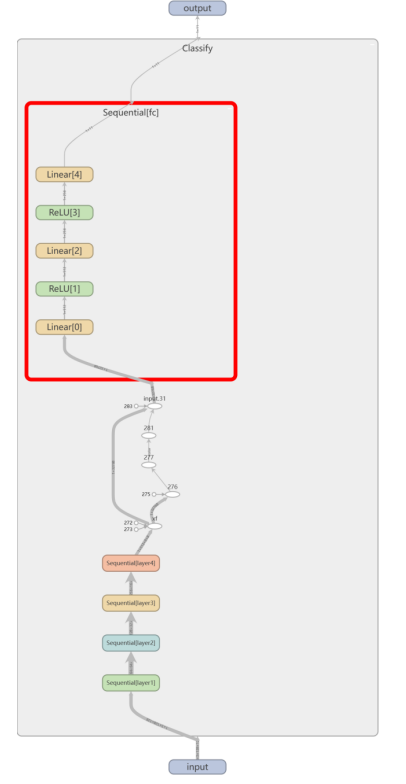
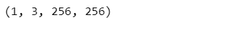

# 7.模型部署

## 学习来源

本次的任务实践是的跟着子豪兄的学习视频：[B站视频](https://space.bilibili.com/1900783)

子豪兄提供的完整代码：[代码](https://github.com/TommyZihao/Train_Custom_Dataset)

实验环境就是在子豪兄推荐的云GPU平台上进行的：[云GPU平台Featurize](https://featurize.cn/?s=d7ce99f842414bfcaea5662a97581bd1)。

参考博客CSDN：[使用ONNX Runtime推理引擎进行加速](https://blog.csdn.net/weixin_54202028/article/details/126299959)

我的完整代码在：[任务7代码](https://github.com/lyc686/datawhale_study/tree/main/code/fruit81-7)

## 一、模型部署

### 1.为什么要进行模型部署

算法/模型搭建完成之后如何部署？是大家都非常关心的一个问题。而[模型部署工具箱 MMDeploy](https://zhuanlan.zhihu.com/p/450342651) 的开源，强势打通了从算法模型到应用程序这 "最后一公里"！


### 2.模型部署流水线

在软件工程中，部署指把开发完毕的软件投入使用的过程，包括环境配置、软件安装等步骤。类似地，对于深度学习模型来说，模型部署指让训练好的模型在特定环境中运行的过程。相比于软件部署，模型部署会面临更多的难题：

1）运行模型所需的环境难以配置。深度学习模型通常是由一些框架编写，比如 PyTorch、TensorFlow。由于框架规模、依赖环境的限制，这些框架不适合在手机、开发板等生产环境中安装。

2）深度学习模型的结构通常比较庞大，需要大量的算力才能满足实时运行的需求。模型的运行效率需要优化。

因为这些难题的存在，模型部署不能靠简单的环境配置与安装完成。经过工业界和学术界数年的探索，模型部署有了一条流行的流水线：


为了让模型最终能够部署到某一环境上，开发者们可以使用任意一种**深度学习框架**来定义网络结构，并通过训练确定网络中的参数。之后，模型的结构和参数会被转换成一种只描述网络结构的**中间表示**，一些针对网络结构的优化会在中间表示上进行。最后，用面向硬件的高性能编程框架(如 CUDA，OpenCL）编写，能高效执行深度学习网络中算子的**推理引擎**会把中间表示转换成特定的文件格式，并在对应硬件平台上高效运行模型。

这一条流水线解决了模型部署中的两大问题：使用对接深度学习框架和推理引擎的中间表示，开发者不必担心如何在新环境中运行各个复杂的框架；通过中间表示的网络结构优化和推理引擎对运算的底层优化，模型的运算效率大幅提升。

## 二、使用ONNX作为中间表示完成模型部署

此次任务中我们使用`ONNX`作为中间表示，并且使用`ONNX Runtime`作为推理引擎完成模型部署。

### 1.安装所需工具包

```python
!pip install numpy pandas matplotlib tqdm opencv-python pillow onnx onnxruntime -i https://pypi.tuna.tsinghua.edu.cn/simple
```

```python
!pip3 install torch torchvision --extra-index-url https://download.pytorch.org/whl/cu113
```

### 2.导出ONNX模型

首先导入我们之前自定义的七层网络模型

```python
import torch.nn as nn
import torchvision.transforms as transforms
from PIL import Image

from torch.utils.data import ConcatDataset, DataLoader, Subset, Dataset
from torchvision.datasets import DatasetFolder, VisionDataset
from torchvision import models
import torch.optim as optim
import torch
import torchvision
import torch.nn.functional as F

import numpy as np
import pandas as pd

import shutil
import os

import matplotlib.pyplot as plt
%matplotlib inline

# 忽略烦人的红色提示
import warnings
warnings.filterwarnings("ignore")

# 随机数和python函数库
import random
import math

# 进度条
from tqdm import tqdm

# cv库
import cv2 as cv

# 有 GPU 就用 GPU，没有就用 CPU
device = torch.device('cuda:0' if torch.cuda.is_available() else 'cpu')

# 有 GPU 就用 GPU，没有就用 CPU
device = torch.device('cuda:0' if torch.cuda.is_available() else 'cpu')
print('device', device)

from torch import nn
class Classify(nn.Module):
    def __init__(self):
        super(Classify, self).__init__()
        
        # Input图片是3*256*256
        self.layer1 = nn.Sequential(
            nn.Conv2d(3, 64, 3, 1, 1), # 64*256*256
            nn.BatchNorm2d(64),
            nn.ReLU(),
            nn.MaxPool2d(2, 2, 0) # 64*128*128
        )

        self.layer2 = nn.Sequential(
            nn.Conv2d(64, 128, 3, 1, 1), # 128*128*128
            nn.BatchNorm2d(128),
            nn.ReLU(),
            nn.MaxPool2d(2, 2, 0) # 128*64*64
        )

        self.layer3 = nn.Sequential(
            nn.Conv2d(128, 256, 3, 1, 1), # 256*64*64
            nn.BatchNorm2d(256),
            nn.ReLU(),
            nn.MaxPool2d(2, 2, 0) #256*32*32
        )

        self.layer4 = nn.Sequential(
            nn.Conv2d(256, 512, 3, 1, 1), # 512*32*32
            nn.BatchNorm2d(512),
            nn.ReLU(),
            nn.MaxPool2d(2, 2, 0) # 512*16*16
        )
       
        # 定义全连接部分
        self.fc1 = nn.Sequential(
            nn.Linear(512*16*16,512),
            nn.ReLU()
        )

        self.fc2 = nn.Sequential(
            nn.Linear(512, 256),
            nn.ReLU()
        )

        self.fc3 = nn.Sequential(
            nn.Linear(256, 11)
        )
        

    def forward(self, x):

        x1 = self.layer1(x)        
        x2 = self.layer2(x1)    
        x3 = self.layer3(x2)     
        x4 = self.layer4(x3)
   
        xf1 = x4.flatten(1)
        #xf1 = xf1.view(xf1.size()[0],-1)
        xf2 = self.fc1(xf1)
        xf3 = self.fc2(xf2)

        result = self.fc3(xf3)
               
        return result
```

```python
model = torch.load('checkpoints/dog25_pytorch_20230122.pth')
model = model.eval().to(device)
```

具体的模型样式我们可以使用`tensorboardX`进行可视化出来。




### 3.测试中文字体

```python
# Linux操作系统，例如 云GPU平台：https://featurize.cn/?s=d7ce99f842414bfcaea5662a97581bd1
# 如果遇到 SSL 相关报错，重新运行本代码块即可
!wget https://zihao-openmmlab.obs.cn-east-3.myhuaweicloud.com/20220716-mmclassification/dataset/SimHei.ttf -O /environment/miniconda3/lib/python3.7/site-packages/matplotlib/mpl-data/fonts/ttf/SimHei.ttf
!rm -rf /home/featurize/.cache/matplotlib

import matplotlib
matplotlib.rc("font",family='SimHei') # 中文字体
```

```python
plt.plot([1,2,3], [100,500,300])
plt.title('matplotlib中文字体测试', fontsize=25)
plt.xlabel('X轴', fontsize=15)
plt.ylabel('Y轴', fontsize=15)
plt.show()
```


### 4.pytorch模型转ONNX中间表示

ONNX （Open Neural Network Exchange）是 Facebook 和微软在2017年共同发布的，用于标准描述计算图的一种格式。目前，在数家机构的共同维护下，ONNX 已经对接了多种深度学习框架和多种推理引擎。因此，ONNX 被当成了深度学习框架到推理引擎的桥梁，就像编译器的中间语言一样。由于各框架兼容性不一，我们通常只用 ONNX 表示更容易部署的静态图。

```python
x = torch.randn(1, 3, 256, 256).to(device)

with torch.no_grad():
    torch.onnx.export(
        model,                   # 要转换的模型
        x,                       # 模型的任意一组输入
        'dog25_model.onnx', # 导出的 ONNX 文件名
        opset_version=11,        # ONNX 算子集版本
        input_names=['input'],   # 输入 Tensor 的名称（自己起名字）
        output_names=['output']  # 输出 Tensor 的名称（自己起名字）
    ) 
```

其中，**`torch.onnx.export`** 是 PyTorch 自带的把模型转换成 ONNX 格式的函数。让我们先看一下前三个必选参数：前三个参数分别是**要转换的模型**、**模型的任意一组输入**、**导出的 ONNX 文件的文件名**。转换模型时，需要原模型和输出文件名是很容易理解的，但为什么需要为模型提供一组输入呢？这就涉及到 ONNX 转换的原理了。从 PyTorch 的模型到 ONNX 的模型，本质上是一种语言上的翻译。直觉上的想法是像编译器一样彻底解析原模型的代码，记录所有控制流。但前面也讲到，我们通常只用 ONNX 记录不考虑控制流的**静态图**。因此，PyTorch 提供了一种叫做**追踪（trace）**的模型转换方法：给定一组输入，再实际执行一遍模型，即把这组输入对应的计算图记录下来，保存为 ONNX 格式。export 函数用的就是追踪导出方法，需要给任意一组输入，让模型跑起来。我们的测试图片是三通道，256x256大小的，这里也构造一个同样形状的随机张量。

剩下的参数中，opset_version 表示 ONNX 算子集的版本。深度学习的发展会不断诞生新算子，为了支持这些新增的算子，ONNX会经常发布新的算子集，目前已经更新15个版本。我们令 opset_version = 11，即使用第11个 ONNX 算子集，使用的时候主要考虑当前模型在opset哪一个版本中才得到支持。剩下的两个参数 input_names, output_names 是输入、输出 tensor的名称。

### 5.随机一个输入跑通模型

```python
x = torch.randn(1, 3, 256, 256).to(device)
output = model(x)
output.shape
```


### 6.测试ONNX是否成功导出

```python
import onnx

# 读取 ONNX 模型
onnx_model = onnx.load('dog25_model.onnx')

# 检查模型格式是否正确
onnx.checker.check_model(onnx_model)

print('无报错，onnx模型载入成功')
```


### 7.以可读的形式打印计算图

```python
print(onnx.helper.printable_graph(onnx_model.graph))
```


### 8.使用Netron对ONNX模型可视化

[Netron](https://netron.app)是开源的模型可视化工具来可视化 ONNX 模型。把 `.onnx 文件`从本地的文件系统拖入网站，即可看到如下的可视化结果。

例如当前模型的可视化结果如下图所示，可以发现和上面tensorboardX可视化的模型结构是一致的：


同时点击 input 或者 output，可以查看 ONNX 模型的基本信息，包括模型的版本信息，以及模型输入、输出的名称和数据类型。点击其他层也可以看到对应层的信息。


## 三、使用推理引擎ONNX Runtime部署-预测单张图像

使用推理引擎ONNX Runtime，读取`.onnx 格式`的模型文件，对单张图像文件进行预测。

### 1.应用场景

以下代码在需要部署的**硬件**上运行


只需把onnx模型文件发到部署硬件上，并安装 ONNX Runtime 环境，用几行代码就可以运行模型了。

### 2.**载入 onnx 模型，获取 ONNX Runtime 推理器**

```python
import onnxruntime
import numpy as np
import torch

ort_session = onnxruntime.InferenceSession('dog25_model.onnx')

# 构造输入，获取输出结果
x = torch.randn(1, 3, 256, 256).numpy()
print(x.shape)
# onnx runtime 输入
ort_inputs = {'input': x}

# onnx runtime 输出
ort_output = ort_session.run(['output'], ort_inputs)[0]
print(ort_output.shape)
```



### 3.图像预处理+载入图像

```python
from torchvision import transforms

# 测试集图像预处理-RCTN：缩放、裁剪、转 Tensor、归一化
test_transform = transforms.Compose([transforms.Resize(300),
                                     transforms.CenterCrop(256),
                                     transforms.ToTensor(),
                                     transforms.Normalize(
                                         mean=[0.485, 0.456, 0.406], 
                                         std=[0.229, 0.224, 0.225])
                                    ])
img_path = './dataset/test/萨摩耶1.jpg'
# 用 pillow 载入
from PIL import Image
img_pil = Image.open(img_path)

img_pil
```


### 4.进行前向预测

```python
import torch.nn.functional as F

# 运行预处理
input_img = test_transform(img_pil)
print(input_img.shape)
input_tensor = input_img.unsqueeze(0).numpy()
print(input_tensor.shape)

# ONNX Runtime 输入
ort_inputs = {'input': input_tensor}

# ONNX Runtime 输出
pred_logits = ort_session.run(['output'], ort_inputs)[0]
pred_logits = torch.tensor(pred_logits)
print(pred_logits.shape)
pred_softmax = F.softmax(pred_logits, dim=1) # 对 logit 分数做 softmax 运算
print(pred_softmax.shape)
```


可以观察到和我们原来执行前向预测的代码不同，在这里使用`ONNX Runtime推理引擎`和ONNX Runtime相关的代码只有几行，对应的函数分别可以解释为：

1. `ort_inputs`其中输入值字典的 key 为张量名，value 为 numpy 类型的张量值。**输入**和**输出**张量的名称需要和**`torch.onnx.export`** 中设置的输入输出名对应。
2. **`onnxruntime.InferenceSession`**用于获取一个 ONNX Runtime 推理器，其参数是用于推理的 ONNX 模型文件。
3. 推理器的 **`run`** 方法用于模型推理，其第一个参数为输出张量名的列表，第二个参数为输入值的字典。

回顾一下之前的预处理代码：

```python
input_img = test_transform(img_pil) # 预处理
input_img = input_img.unsqueeze(0).to(device)
# 执行前向预测，得到所有类别的 logit 预测分数
pred_logits = model(input_img) 
print(pred_logits)
pred_softmax = F.softmax(pred_logits, dim=1) # 对 logit 分数做 softmax 运算
print(pred_softmax)
```

发现差别还是挺大的，使用推理引擎执行模型的**好处**是：如果ONNX Runtime成功运行了模型，说明模型部署完成了。以后有用户想实现的模型操作，我们只需要提供一个 ".onnx" 文件，并帮助用户配置好ONNX Runtime的Python 环境，用几行代码就可以运行模型了。或者还有更简便的方法，我们可以利用ONNX Runtime编译出一个可以直接执行模型的**应用程序**。我们只需要给用户提供 ONNX 模型文件，并让用户在应用程序选择要执行的ONNX模型文件名就可以运行模型了。

### 5.解析预测结果

那么我们完成了测试图片的前向传播之后我们可以可视化一些预测结果。

```python
# 载入类别和对应ID
idx_to_labels = np.load('idx_to_labels.npy', allow_pickle=True).item()
print(idx_to_labels)

# 绘制预测概率柱状图
import matplotlib.pyplot as plt
%matplotlib inline

plt.figure(figsize=(22, 10))

x = idx_to_labels.values()
y = pred_softmax.cpu().detach().numpy()[0] * 100
width = 0.45 # 柱状图宽度

ax = plt.bar(x, y, width)

plt.bar_label(ax, fmt='%.2f', fontsize=15) # 置信度数值
plt.tick_params(labelsize=20) # 设置坐标文字大小

plt.title(img_path, fontsize=30)
plt.xticks(rotation=45) # 横轴文字旋转
plt.xlabel('类别', fontsize=20)
plt.ylabel('置信度', fontsize=20)
plt.show()
```


