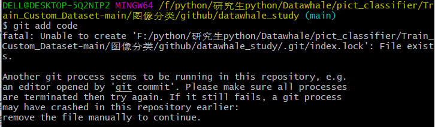
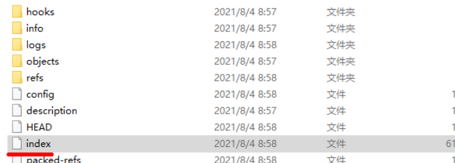
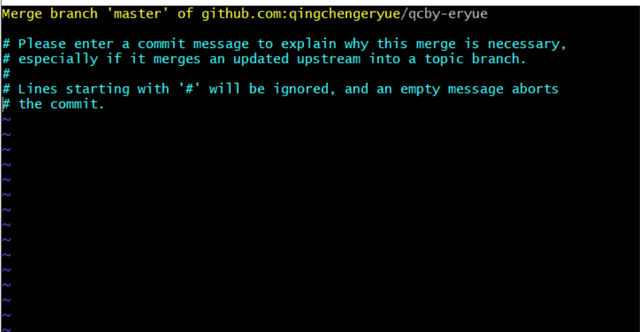

# 在git Bash中提交的时候遇到的问题

## 1.git add之前存在提交失败的大文件时



翻译：另一个git进程似乎正在这个存储库中运行，例如。“gitcommit”打开的编辑器。请确保所有流程请终止，然后重试。如果它仍然失败，git进程可能早在该存储库中崩溃：手动删除该文件以继续。

解决方法：

1.误操作比如(git commit) 直接提交 导致检索不到要保存的信息他就会锁定当前的文件

2.git下的`index.lock`文件，在进行某些比较费时的git操作时自动生成，操作结束后自动删除，相当于一个锁定文件，目的在于防止对一个目录同时进行多个操作。有时强制关闭进行中的git操作，这个文件没有被自动删除，之后就无法进行其他git操作，必须手动删除。


删除之后就能够正常使用git指令进行提交了。

## 2.如果远端的github仓库存在改变时

首先使用

```bash
git pull
```

将仓库的最新情况拉取下来。

如果出现一下场景，说明更新之后有冲突，要查看之后再决定。

解决方法：

只需要正常:wq 保存并退出。即可正常使用git操作。




## 3.git中使用python

一般直接在git bash中直接输入[python](https://so.csdn.net/so/search?q=python&spm=1001.2101.3001.7020)后会无反应

 

1. 可以在python前添加 winpty

   ```bash
   winpty python
   ```


2. 每次在python前添加winpty有些麻烦，我们可以执行指令生成一个名为“python”的别名

   ```bash
   alias python='winpty python.exe'
   ```


## 4.git commit大于100MB文件报错

当我们在使用git commit提交文件的时候如果大于100MB会报错，因为git hub一个接收文件的大小最大时100MB。

解决方案：

网上的解决方案：https://www.yisu.com/zixun/620433.html

亲测有效的：使用git reset进行版本回滚

```python
#查询提交日志，获取提交head
git log

#撤销commit到指定的版本，本地修改的文件不会变动
git reset --soft 92e076f29644031bf8430d63bbf1f9f85b625d5c
```

然后再正常使用git操作即可。
